# Global State Schema Specification

> **Project Ronin** — AI-Powered Black-Box API Security Testing CLI Tool  
> **Version:** 1.0.0-spec  
> **Status:** Active

---

## 1. Overview & Architecture

Project Ronin leverages **LangGraph** to coordinate multi-agent security testing workflows. The central spine of this architecture is the **Global State (`ScanState`)**, a structured, typed Pydantic object passed between and mutated by specialized agents.

```
       ┌────────────────────────────────────────────────────────┐
       │                   ScanState Container                  │
       │                                                        │
       │  [Configuration]    scan_id, target_url, filters       │
       │  [Recon Data]       discovered_endpoints               │
       │  [Exploit Data]     attack_surface                     │
       │  [Validation Data]  validated_findings                 │
       │  [Execution Flow]   phase, endpoint_index, errors      │
       └───────────────────────────┬────────────────────────────┘
                                   │
         ┌─────────────────────────┼─────────────────────────┐
         ▼                         ▼                         ▼
  [ Recon Agent ]        [ Exploit Agent ]         [ Validation Agent ]
  Populates:             Populates:                Populates:
  discovered_endpoints   attack_surface            validated_findings
```

---

## 2. Complete Pydantic Model Definitions

All state models are implemented using **Pydantic v2** (`pydantic.BaseModel`) with strict type validation, field constraints, and JSON serialization helpers.

```python
"""
project_ronin.models.state
--------------------------
Pydantic v2 models defining the global scan state, endpoint representations,
fuzzing payloads, suspected vulnerabilities, and confirmed security findings.
"""

from __future__ import annotations
from enum import Enum
from typing import Any, Dict, List, Literal, Optional
from pydantic import BaseModel, Field, HttpUrl


# ============================================================================
# Enums & Type Aliases
# ============================================================================

class ScanPhase(str, Enum):
    """Enumeration of distinct operational phases in the scan lifecycle."""
    INIT = "init"
    RECON = "recon"
    EXPLOIT = "exploit"
    VALIDATE = "validate"
    REPORT = "report"
    COMPLETED = "completed"
    FAILED = "failed"


class ParameterLocation(str, Enum):
    """Specifies where an HTTP parameter resides within a request."""
    PATH = "path"
    QUERY = "query"
    HEADER = "header"
    BODY = "body"


class SeverityLevel(str, Enum):
    """Standardized CVSS-aligned severity rankings."""
    CRITICAL = "CRITICAL"
    HIGH = "HIGH"
    MEDIUM = "MEDIUM"
    LOW = "LOW"
    INFO = "INFO"


# ============================================================================
# Sub-Models: Endpoints and Parameters
# ============================================================================

class Parameter(BaseModel):
    """Represents a single input parameter discovered on an API endpoint."""
    name: str = Field(
        ...,
        description="The parameter key or JSON property name.",
        examples=["id", "page", "Authorization", "email"]
    )
    location: ParameterLocation = Field(
        ...,
        description="The location of the parameter within the HTTP request."
    )
    param_type: str = Field(
        default="string",
        description="Data type of the parameter (e.g., 'string', 'integer', 'boolean', 'object', 'array')."
    )
    required: bool = Field(
        default=False,
        description="Whether the parameter is required by the API endpoint."
    )
    sample_value: Optional[str] = Field(
        default=None,
        description="A known valid or default sample value for fuzzing baselines."
    )


class Endpoint(BaseModel):
    """Represents a unique API endpoint and its structural metadata."""
    method: str = Field(
        ...,
        description="HTTP method (verb) uppercase.",
        examples=["GET", "POST", "PUT", "DELETE", "PATCH", "OPTIONS", "HEAD"]
    )
    path: str = Field(
        ...,
        description="Relative URL path, including any path parameters.",
        examples=["/api/v1/users", "/api/v1/users/{id}"]
    )
    parameters: List[Parameter] = Field(
        default_factory=list,
        description="List of all query, path, header, and body parameters associated with this endpoint."
    )
    content_type: Optional[str] = Field(
        default="application/json",
        description="Expected request body MIME type."
    )
    auth_required: Optional[bool] = Field(
        default=None,
        description="Whether the endpoint returned 401/403 during unauthenticated recon probes."
    )
    sample_response: Optional[Dict[str, Any]] = Field(
        default=None,
        description="Baseline HTTP response snapshot captured during reconnaissance."
    )


# ============================================================================
# Sub-Models: Exploitation & Proof of Concept
# ============================================================================

class RequestEvidence(BaseModel):
    """Captures HTTP request details used during an exploit or validation test."""
    method: str = Field(..., description="HTTP Method used in the probe.")
    url: str = Field(..., description="Target URL invoked.")
    headers: Dict[str, str] = Field(default_factory=dict, description="Headers sent with the request.")
    body: Optional[Any] = Field(default=None, description="Request payload or JSON body.")


class ResponseEvidence(BaseModel):
    """Captures HTTP response details confirming or denying an exploit."""
    status_code: int = Field(..., description="HTTP response status code.")
    headers: Dict[str, str] = Field(default_factory=dict, description="HTTP response headers returned.")
    body_snippet: str = Field(default="", description="Snippet or full body of the response demonstrating vulnerability.")
    response_time_ms: Optional[float] = Field(default=None, description="Latency in milliseconds.")


class SuspectedVuln(BaseModel):
    """A potential vulnerability flagged by the Exploitation Agent requiring validation."""
    endpoint: Endpoint = Field(
        ...,
        description="The endpoint where the anomaly or vulnerability was flagged."
    )
    vuln_type: str = Field(
        ...,
        description="Classification of vulnerability (e.g., 'BOLA', 'BrokenAuth', 'SecurityMisconfiguration', 'SQLi')."
    )
    evidence: str = Field(
        ...,
        description="LLM reasoning and explanation of why this interaction indicates a vulnerability."
    )
    confidence: float = Field(
        default=0.7,
        ge=0.0,
        le=1.0,
        description="Confidence score (0.0 to 1.0) assigned by the Exploitation Agent."
    )
    raw_request: RequestEvidence = Field(
        ...,
        description="The exact HTTP request that produced the suspicious response."
    )
    raw_response: ResponseEvidence = Field(
        ...,
        description="The HTTP response that triggered the suspicion."
    )


class ProofOfConcept(BaseModel):
    """Structured reproduction artifact confirming exploitability."""
    request: RequestEvidence = Field(..., description="Reproduction HTTP request.")
    response: ResponseEvidence = Field(..., description="Vulnerable HTTP response.")


class Finding(BaseModel):
    """A confirmed and validated security vulnerability ready for inclusion in reports."""
    id: str = Field(
        ...,
        description="Unique finding identifier (e.g., 'RONIN-001').",
        examples=["RONIN-001", "RONIN-002"]
    )
    title: str = Field(
        ...,
        description="Concise descriptive title of the vulnerability.",
        examples=["BOLA on GET /api/v1/users/{id}"]
    )
    severity: SeverityLevel = Field(
        ...,
        description="Severity level aligned with CVSS scoring."
    )
    cvss_score: float = Field(
        ...,
        ge=0.0,
        le=10.0,
        description="CVSS v3.1 Base Score."
    )
    category: str = Field(
        ...,
        description="OWASP API Security Top 10 category.",
        examples=["API1:2023 - Broken Object Level Authorization"]
    )
    description: str = Field(
        ...,
        description="Comprehensive technical narrative detailing root cause and impact."
    )
    proof_of_concept: ProofOfConcept = Field(
        ...,
        description="Validated request and response evidence."
    )
    steps_to_reproduce: List[str] = Field(
        default_factory=list,
        description="Ordered steps to manually verify the finding."
    )
    remediation: str = Field(
        ...,
        description="Prescriptive technical instructions to resolve the vulnerability."
    )
    references: List[str] = Field(
        default_factory=list,
        description="External reference links (OWASP, CWE, CVE, advisory docs)."
    )


# ============================================================================
# Root Model: ScanState
# ============================================================================

class ScanState(BaseModel):
    """
    Global state container passed between LangGraph agent nodes.
    Represents the full context, telemetry, and findings of a single scan run.
    """
    # ------------------------------------------------------------------------
    # 1. Scan Configuration & Inputs
    # ------------------------------------------------------------------------
    scan_id: str = Field(
        ...,
        description="Unique scan run identifier (e.g., 'ronin-20260820-001530')."
    )
    target_url: str = Field(
        ...,
        description="Normalized target base URL (e.g., 'https://api.example.com')."
    )
    provided_endpoints: Optional[List[Endpoint]] = Field(
        default=None,
        description="Endpoints loaded from an external file (Postman or text) during initialization."
    )
    include_patterns: List[str] = Field(
        default_factory=list,
        description="Glob patterns restricting testing to matching endpoint paths."
    )
    exclude_patterns: List[str] = Field(
        default_factory=list,
        description="Glob patterns excluding matching endpoint paths from testing."
    )

    # ------------------------------------------------------------------------
    # 2. Reconnaissance Artifacts
    # ------------------------------------------------------------------------
    discovered_endpoints: List[Endpoint] = Field(
        default_factory=list,
        description="Complete list of filtered endpoints ready for exploitation."
    )

    # ------------------------------------------------------------------------
    # 3. Exploitation & Attack Surface
    # ------------------------------------------------------------------------
    attack_surface: List[SuspectedVuln] = Field(
        default_factory=list,
        description="Collection of suspected vulnerabilities flagged for verification."
    )

    # ------------------------------------------------------------------------
    # 4. Validated Findings
    # ------------------------------------------------------------------------
    validated_findings: List[Finding] = Field(
        default_factory=list,
        description="Confirmed vulnerabilities that passed sandbox verification."
    )

    # ------------------------------------------------------------------------
    # 5. Execution Flow & State Control
    # ------------------------------------------------------------------------
    current_phase: ScanPhase = Field(
        default=ScanPhase.INIT,
        description="Current operational phase of the LangGraph workflow."
    )
    current_endpoint_index: int = Field(
        default=0,
        ge=0,
        description="Pointer to the endpoint currently undergoing exploitation or validation."
    )
    errors: List[str] = Field(
        default_factory=list,
        description="Non-fatal warning or error messages accumulated during execution."
    )
```

---

## 3. State Transitions & Agent Access Matrix

The table below defines which agent has permission to **Read (R)**, **Write/Mutate (W)**, or **Append (A)** specific state fields during each workflow stage.

| State Field | Orchestrator | Recon Agent | Exploitation Agent | Validation Agent |
|---|:---:|:---:|:---:|:---:|
| `scan_id` | **W** (Init) / R | R | R | R |
| `target_url` | **W** (Init) / R | R | R | R |
| `provided_endpoints` | **W** (CLI) / R | R | - | - |
| `include_patterns` | **W** (CLI) / R | R | - | - |
| `exclude_patterns` | **W** (CLI) / R | R | - | - |
| `discovered_endpoints` | R | **W** (Discovers) | R | R |
| `attack_surface` | R | - | **A** (Flags Suspects) | R |
| `validated_findings` | R / Export | - | - | **A** (Confirms) |
| `current_phase` | **W** (Transitions) | - | - | - |
| `current_endpoint_index` | **W** (Loops) | - | R | R |
| `errors` | **A** | **A** | **A** | **A** |

---

### 3.1 Field-by-Field Lifecycle Responsibilities

1. **`scan_id`, `target_url`, `include_patterns`, `exclude_patterns`:**
   - **Orchestrator** initializes these fields upon CLI invocation parsing.
   - Read-only for downstream agents.

2. **`discovered_endpoints`:**
   - In Mode B/C, the **Recon Agent** extracts endpoints from input files, applies scope filters, and writes the list.
   - In Mode A, the **Recon Agent** probes wordlists, discovers schemas, filters results, and populates this list.
   - Read-only for **Exploitation Agent** and **Validation Agent**.

3. **`attack_surface`:**
   - Populated exclusively by the **Exploitation Agent**.
   - Appends a `SuspectedVuln` object each time an LLM or deterministic rule observes an exploit indicator (e.g., status 200 on unauthorized object swap).

4. **`validated_findings`:**
   - Populated exclusively by the **Validation Agent**.
   - When a `SuspectedVuln` is confirmed via Python sandbox reproduction, a standardized `Finding` is constructed and appended. False positives are logged to `errors`/logs and discarded.

5. **`current_phase` & `current_endpoint_index`:**
   - Managed strictly by the **Orchestrator** router to control LangGraph state transitions and endpoint batch iteration.

6. **`errors`:**
   - All agents can append non-fatal warning messages, sandbox timeouts, or connectivity glitches.

---

## 4. State Lifecycle Diagram

The following Mermaid diagram illustrates the lifecycle of `ScanState` as it passes through the multi-agent system from initialization to report output.

```mermaid
stateDiagram-v2
    [*] --> INIT: CLI Command Ingestion
    
    state INIT {
        [*] --> ParseArgs
        ParseArgs --> InitState: Generate scan_id, target_url, patterns
        InitState --> [*]
    }
    
    INIT --> RECON: Transition(phase="recon")
    
    state RECON {
        [*] --> ProbeWordlists
        ProbeWordlists --> ParseDocs: Check Swagger/OpenAPI/Postman
        ParseDocs --> ApplyScopeFilters: Filter by include/exclude
        ApplyScopeFilters --> WriteDiscovered: Write discovered_endpoints
        WriteDiscovered --> [*]
    }
    
    RECON --> EXPLOIT: Transition(phase="exploit", index=0)
    
    state EXPLOIT {
        [*] --> SelectEndpoint: Read discovered_endpoints[index]
        SelectEndpoint --> GeneratePayloads: BOLA / Auth / Headers / Injection
        GeneratePayloads --> SendProbes: httpx probe requests
        SendProbes --> AnalyzeResponse: LLM analyzes status & body
        AnalyzeResponse --> FlagSuspect: Append to attack_surface
        FlagSuspect --> [*]
    }
    
    EXPLOIT --> VALIDATE: Suspected Vuln Found
    
    state VALIDATE {
        [*] --> GenPoCScript: Validation Agent creates Python script
        GenPoCScript --> ExecSandbox: Run script in Docker sandbox
        ExecSandbox --> CheckResult: Exit code == 0 & payload verified?
        CheckResult --> ConfirmFinding: Yes -> Construct Finding, append validated_findings
        CheckResult --> RejectFP: No -> Log False Positive
        ConfirmFinding --> [*]
        RejectFP --> [*]
    }
    
    VALIDATE --> CHECK_MORE
    EXPLOIT --> CHECK_MORE: No Vuln on Current Endpoint
    
    state CHECK_MORE <<choice>>
    CHECK_MORE --> EXPLOIT: index < len(discovered_endpoints) [Increment index]
    CHECK_MORE --> REPORT: index >= len(discovered_endpoints)
    
    state REPORT {
        [*] --> CompileMetrics: Calculate summary totals
        CompileMetrics --> RenderJSON: Write report.json
        RenderJSON --> RenderHTML: Render Jinja2 report.html
        RenderHTML --> SaveArtifacts: Save PoCs & State to disk
        SaveArtifacts --> [*]
    }
    
    REPORT --> COMPLETED: Transition(phase="completed")
    COMPLETED --> [*]
```



---

## 5. State Serialization & Persistence

- **Disk Checkpointing:** After each agent node completes execution in LangGraph, `ScanState` is dumped to `./ronin_runs/<scan-id>/scan_state.json` via Pydantic's `model_dump_json(indent=2)`.
- **Fault Recovery:** In the event of an unexpected crash or container interruption, scans can be resumed using `ronin resume --scan-id <scan-id>`, which re-hydrates `ScanState` from the checkpoint and restarts at `current_endpoint_index`.
- **Database Backend:** For multi-scan history and analytics, the serialized dictionary is stored in MongoDB inside the `scans` collection.
