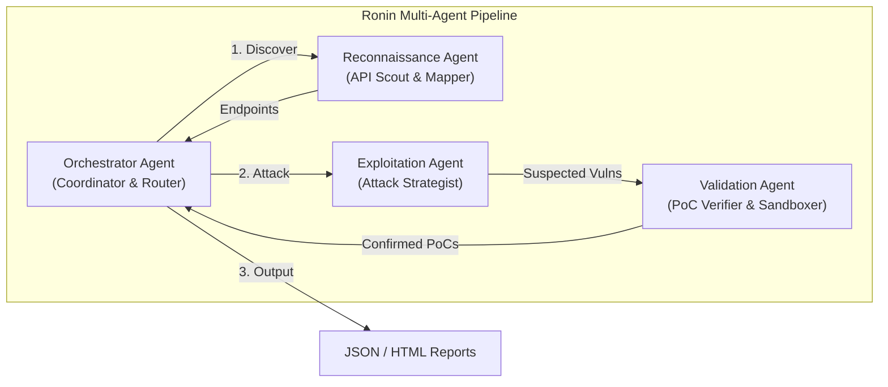
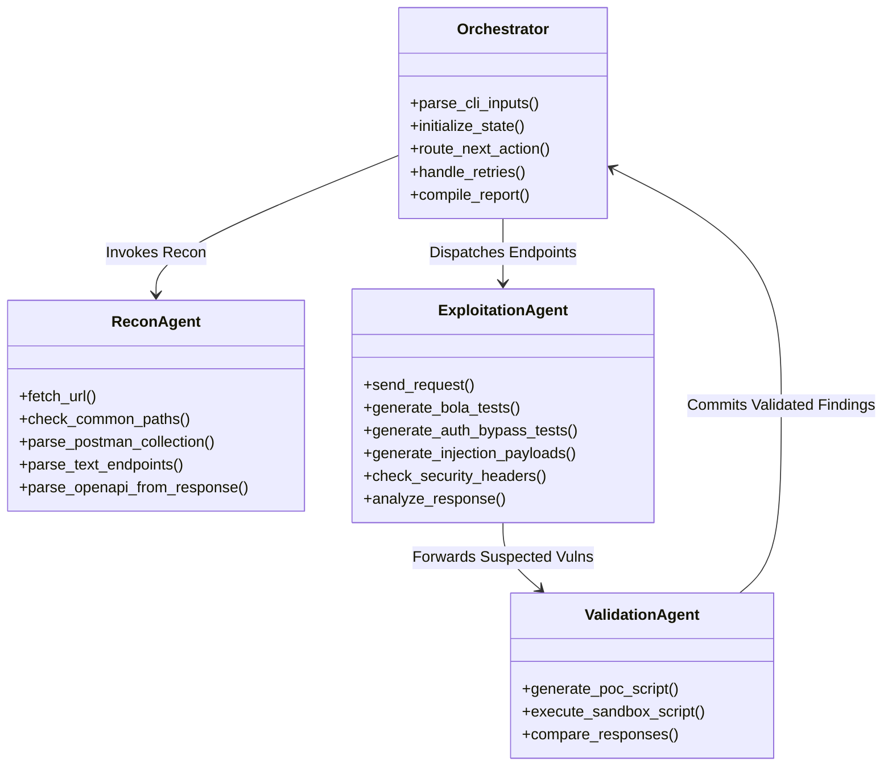
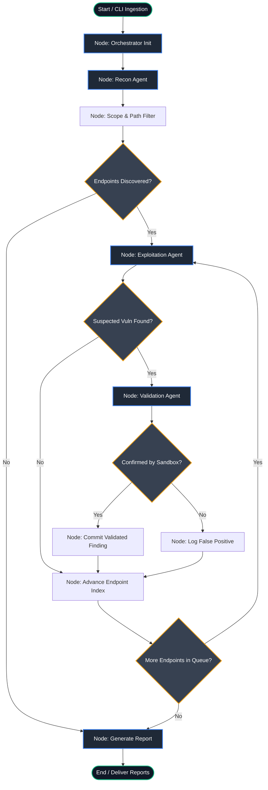
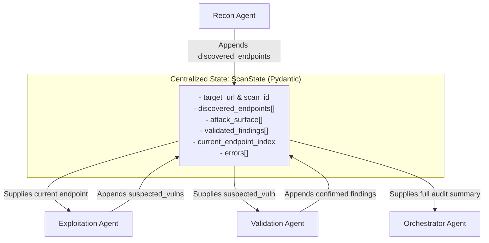
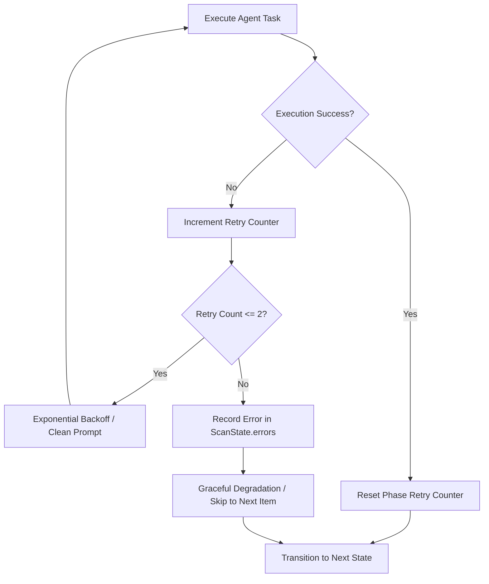

# Multi-Agent Architecture

## 1. Agent Overview and Philosophy

Project Ronin adopts a **modular, multi-agent architecture** managed by **LangGraph** to automate black-box API security testing. Rather than relying on a single monolithic LLM prompt to discover, attack, and verify vulnerabilities, Ronin divides offensive security workflows into distinct, specialized agents.



### Why Multi-Agent vs. Single Agent?

1. **Context Window Preservation (Optimized for 7B Local LLMs):**
   Local models like **Qwen 2.5 Coder 7B** have bounded attention capacity. Feeding an entire OpenAPI specification, thousands of fuzzing responses, and PoC code into a single context prompt leads to hallucinations and missed vulnerabilities. Dedicated agents receive only scoped, relevant state slices.

2. **Role-Specialized Prompting & Personas:**
   - **Recon Agent:** Tuned for precision schema parsing, URL normalization, and parameter inference.
   - **Exploitation Agent:** Tuned for offensive threat modeling, heuristic fuzzing, and anomaly detection.
   - **Validation Agent:** Tuned for writing deterministic, isolated Python PoC scripts and rigorous assertion verification.

3. **Deterministic State Machine vs. Stochastic Hallucinations:**
   Iterating over 50 API endpoints, managing timeouts, and tracking execution phases is strictly handled by **LangGraph's deterministic graph logic**. The LLM is invoked only for cognitive security tasks (e.g., payload generation, response anomaly interpretation, and PoC synthesis).

4. **False Positive Elimination:**
   An attack agent often guesses vulnerabilities based on suspicious status codes (e.g., HTTP 200 on an IDOR probe). Separating exploitation from a dedicated **Validation Agent** that actually runs code in a Docker sandbox ensures that only verified flaws make it to the final report.

---

## 2. Detailed Agent Specifications



### 2.1 Orchestrator Agent (Manager & Router)
- **Role:** Workflow manager and deterministic coordinator.
- **LLM Call Volume:** Minimal (deterministic logic).
- **Core Responsibilities:**
  - Ingests CLI flags (target URL, custom files, inclusion/exclusion regex).
  - Initializes the shared `ScanState` data structure.
  - Controls graph phase transitions (`recon` → `exploit` → `validate` → `report`).
  - Iterates over the queue of discovered endpoints.
  - Manages error budgets and retries (maximum 2 retries per agent failure).
  - Aggregates confirmed findings and generates JSON and HTML deliverables.

### 2.2 Reconnaissance Agent (API Scout)
- **Role:** API surface discovery and endpoint mapping.
- **LLM Call Volume:** Medium (analyzes unknown responses, parses unformatted API docs, infers parameter types).
- **Tools & Capabilities:**
  - `fetch_url`: Issues HTTP requests and inspects headers, bodies, and status codes.
  - `parse_postman_collection`: Parses Postman JSON export v2.0/v2.1 to extract routes, query parameters, headers, and request bodies.
  - `parse_text_endpoints`: Ingests line-delimited endpoint files (e.g., `GET /api/v1/users`).
  - `check_common_paths`: Probes target root against standard API wordlists (`/swagger.json`, `/openapi.json`, `/api/v1/health`, `/v2/api-docs`).
  - `parse_openapi_from_response`: Ingests raw OpenAPI/Swagger specs to produce structured `Endpoint` objects.

### 2.3 Exploitation Agent (Attacker)
- **Role:** Systematic vulnerability probing and heuristic anomaly detection.
- **LLM Call Volume:** Heavy (crafts targeted payloads and interprets response anomalies).
- **Vulnerability Checks:**
  - **BOLA / IDOR (API1):** Generates parameter variations (e.g., sequential integer swapping, UUID tampering, path replacement) to verify unauthorized resource access.
  - **Broken Authentication (API2):** Tests for missing `Authorization` headers, JWT `alg: none` exploits, expired token acceptance, and default credentials.
  - **Security Misconfiguration (API8):** Probes CORS wildcard reflection, missing HTTP security headers (HSTS, CSP, X-Frame-Options), exposed debug routes, and HTTP method tampering (e.g., `OPTIONS`, `TRACE`).
  - **Injection Attacks (SQLi / XSS):** Injects structured SQL syntax breakers (`' OR '1'='1`) and script reflection payloads into discovered query/body parameters.
- **Tools:**
  - `send_request`: Sends HTTP requests with custom headers, methods, and payloads.
  - `generate_bola_tests`: Generates matrix of object ID test requests.
  - `generate_auth_bypass_tests`: Generates authentication bypass mutations.
  - `generate_injection_payloads`: Generates context-aware injection strings.
  - `analyze_response`: Prompts local LLM to analyze response status, headers, and body for indicators of vulnerability.

### 2.4 Validation Agent (Verifier & Sandbox Auditor)
- **Role:** False-positive reduction and exploit confirmation.
- **LLM Call Volume:** Medium (generates clean, standalone Python exploit code).
- **Verification Workflow:**
  - Takes a `SuspectedVuln` object flagged by the Exploitation Agent.
  - Synthesizes a standalone, reproducible Python script containing assertions to verify the flaw.
  - Dispatches the script to the isolated **Docker Sandbox**.
  - Analyzes sandbox execution output (`stdout`, `stderr`, exit code).
  - Flags confirmed findings as `Finding` objects with complete reproduction steps and CVSS scores.
- **Tools:**
  - `generate_poc_script`: Synthesizes an executable Python script utilizing `httpx` or `requests`.
  - `execute_sandbox_script`: Executes code inside the isolated container with strict timeout limits (10s).
  - `compare_responses`: Performs differential response analysis to eliminate caching or generic error false positives.

---

## 3. LangGraph State Machine Architecture

The execution graph is structured as a LangGraph state machine with cyclic endpoint iteration and conditional routing:



---

## 4. Global State (`ScanState`) Schema

Ronin agents communicate by reading and mutating a centralized Pydantic data model.

```python
from typing import Literal, Optional, List, Dict, Any
from pydantic import BaseModel, Field

class Parameter(BaseModel):
    name: str
    location: Literal["path", "query", "header", "body"]
    param_type: str = "string"
    required: bool = False
    sample_value: Optional[str] = None

class Endpoint(BaseModel):
    method: Literal["GET", "POST", "PUT", "DELETE", "PATCH", "OPTIONS", "HEAD"]
    path: str
    parameters: List[Parameter] = Field(default_factory=list)
    content_type: Optional[str] = "application/json"
    auth_required: Optional[bool] = None
    sample_response: Optional[Dict[str, Any]] = None

class ProofOfConcept(BaseModel):
    request_method: str
    request_url: str
    request_headers: Dict[str, str] = Field(default_factory=dict)
    request_body: Optional[str] = None
    response_status: int
    response_body_snippet: str
    poc_script: str  # Standalone Python script

class SuspectedVuln(BaseModel):
    endpoint: Endpoint
    category: str  # e.g., "API1:2023 - BOLA", "API2:2023 - Broken Auth"
    hypothesis: str
    trigger_request: Dict[str, Any]
    observed_response: Dict[str, Any]
    confidence: Literal["low", "medium", "high"]

class Finding(BaseModel):
    id: str  # e.g., "RONIN-001"
    title: str
    severity: Literal["CRITICAL", "HIGH", "MEDIUM", "LOW", "INFO"]
    cvss_score: float
    category: str
    description: str
    proof_of_concept: ProofOfConcept
    steps_to_reproduce: List[str]
    remediation: str
    references: List[str] = Field(default_factory=list)

class ScanState(BaseModel):
    # Scan Identifiers & Targets
    scan_id: str
    target_url: str
    provided_endpoints: Optional[List[Endpoint]] = None
    include_patterns: List[str] = Field(default_factory=list)
    exclude_patterns: List[str] = Field(default_factory=list)

    # Reconnaissance Results
    discovered_endpoints: List[Endpoint] = Field(default_factory=list)

    # Attack & Exploitation State
    attack_surface: List[SuspectedVuln] = Field(default_factory=list)

    # Validated Output
    validated_findings: List[Finding] = Field(default_factory=list)

    # Workflow Control
    current_phase: Literal["init", "recon", "exploit", "validate", "report", "completed", "failed"] = "init"
    current_endpoint_index: int = 0
    retry_counts: Dict[str, int] = Field(default_factory=lambda: {"recon": 0, "exploit": 0, "validate": 0})
    errors: List[str] = Field(default_factory=list)
```

---

## 5. Agent Communication Pattern

Ronin enforces a **Shared State Pattern** over direct agent-to-agent dialogue.



### Key Advantages
- **Determinism:** State fields are strongly typed and validated by Pydantic on every node execution.
- **Traceability & Checkpointing:** The entire `ScanState` is serialized to MongoDB at every node transition, allowing scan pause/resume and full audit inspection.
- **No Token Overhead:** Agents do not re-read conversation transcripts; they read only the specific state keys required for their task.

---

## 6. Error Handling and Retry Strategy



### Resilience Policies
1. **Bounded Retries:** Each agent phase is granted a maximum of **2 retries** per task.
2. **Local LLM Timeout Handling:** Ollama inferences have an upper threshold (30s). If a timeout occurs, temperature is slightly reduced, and prompt length is truncated.
3. **Target API Rate-Limiting:** If HTTP status `429 Too Many Requests` or connection drops occur, Ronin introduces exponential backoff (`2^retry_count * 1.5s`).
4. **Sandbox Isolation Faults:** If a generated PoC Python script encounters a syntax error or infinite loop, the Docker sandbox kills the process at 10 seconds, marks the finding as rejected/inconclusive, and logs the stderr to `ScanState.errors` without crashing the scan pipeline.
