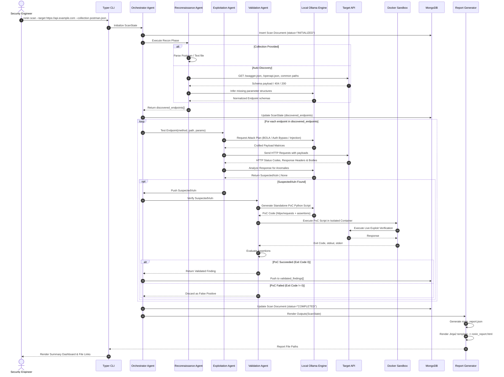
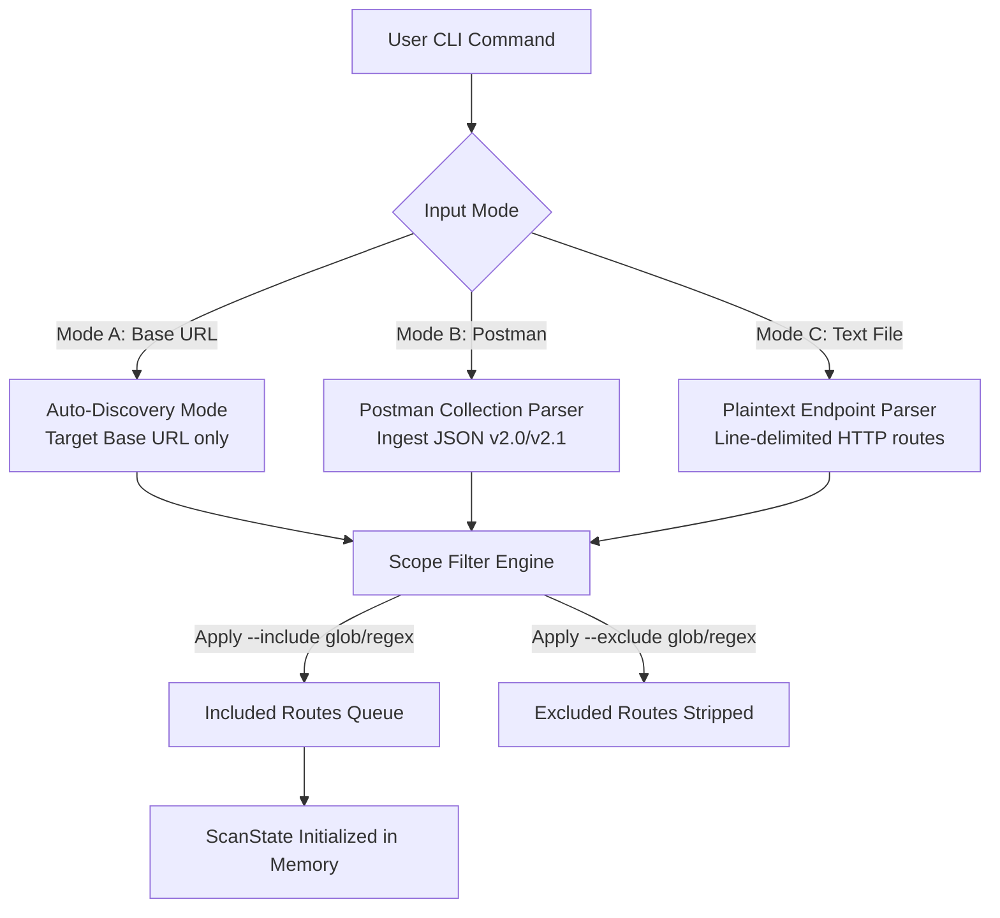
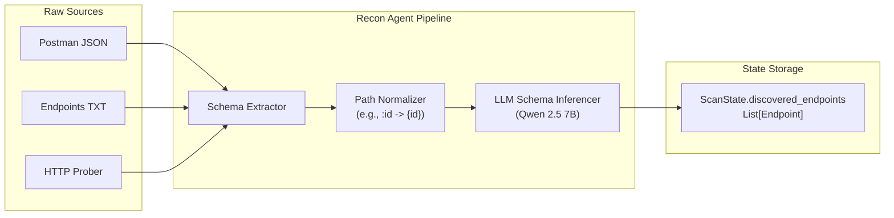
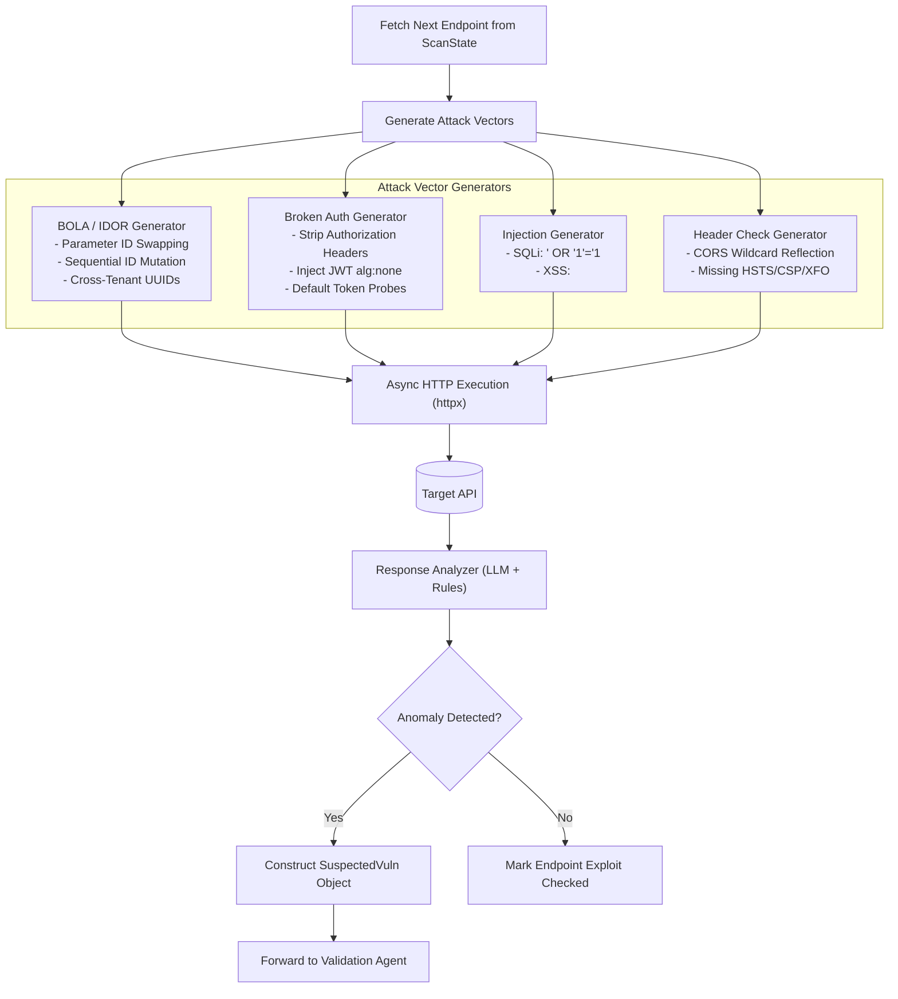
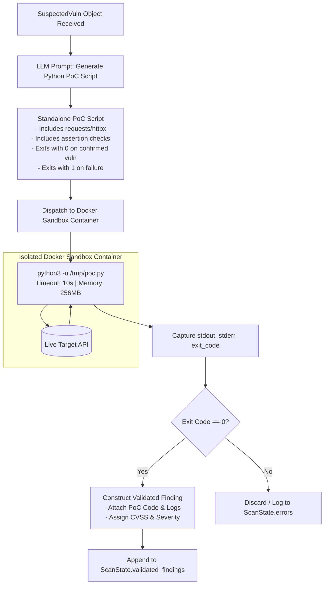
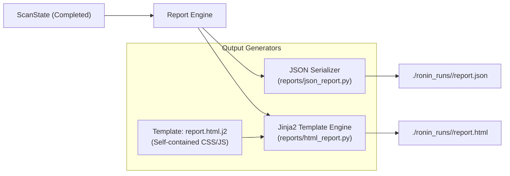
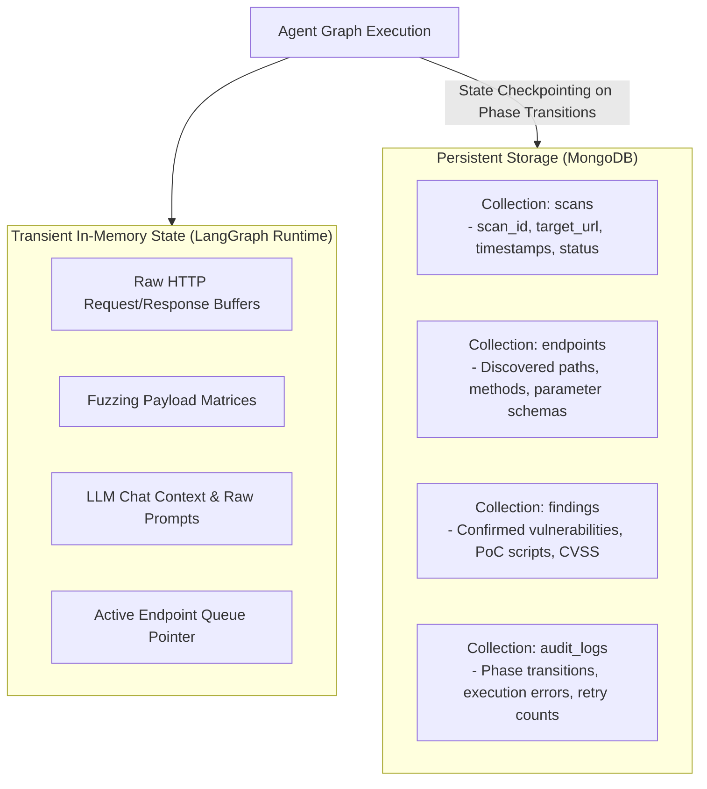

# Data Flow Documentation

## 1. End-to-End Execution Flow

Project Ronin executes automated API security scans through a multi-stage data transformation pipeline. Data flows systematically from raw user input through discovery, heuristic payload exploitation, isolated sandbox verification, persistence, and reporting.



---

## 2. Input Processing Flow

Ronin accepts three primary input modes and applies deterministic scope filters before initiating discovery.



### Input Parsing Details

1. **Auto-Discovery Mode (`--target <url>`):**
   - Directs the Recon Agent to query standard documentation endpoints (`/swagger.json`, `/openapi.json`, `/api-docs`) and run wordlist-based endpoint fuzzing via `common_paths.txt`.

2. **Postman Collection Mode (`--collection <path.json>`):**
   - Parses request items, folder hierarchy, URL structures, query parameters, authorization headers, and raw JSON body templates into typed `Endpoint` and `Parameter` models.

3. **Plaintext Endpoint Mode (`--endpoints <path.txt>`):**
   - Parses space-delimited or standard HTTP request lines:
     ```text
     GET /api/v1/users
     POST /api/v1/users
     GET /api/v1/users/{id}
     DELETE /api/v1/users/{id}
     ```

4. **Scope Inclusion / Exclusion Rules:**
   - Filters are evaluated using Unix-style globbing and regular expressions:
     ```bash
     ronin scan --target https://api.target.com \
       --include "/api/v1/*" \
       --exclude "/api/v1/health" \
       --exclude "/api/v1/docs/*"
     ```

---

## 3. Recon Phase Data Flow

The Reconnaissance phase transforms target URLs and input specifications into structured, standardized API endpoint definitions.



### Endpoint Normalization Process
1. **Path Parameter Standardization:** Replaces `:id`, `<id>`, or `$id` with canonical OpenAPI style `{id}`.
2. **Parameter Typing:** Inferred using static heuristic pattern matching (e.g., UUID regex, integer check) and local LLM body analysis.
3. **Authentication Baselining:** Sends an unauthenticated probe to determine baseline HTTP response codes (`401 Unauthorized`, `403 Forbidden`, vs `200 OK`).

---

## 4. Exploitation Phase Data Flow

The Exploitation Agent iterates over each discovered endpoint to construct targeted attack requests and evaluate responses.



---

## 5. Validation Phase Data Flow

The Validation Agent eliminates false positives by generating and running a standalone Python exploit script inside an isolated Docker sandbox container.



---

## 6. Report Generation Flow

At the conclusion of the scan, the Orchestrator passes the completed `ScanState` to the Report Engine to render machine-readable and human-readable artifacts.



### Report Deliverables
- **`report.json`:** Standardized machine-readable format containing full scan metadata, tested endpoints, severity breakdown, CVSS scores, and structured PoC request/response bodies.
- **`report.html`:** Self-contained, zero-dependency HTML dashboard with interactive severity filters, collapsible vulnerability cards, and remediation guidance.

---

## 7. Data Persistence Strategy

Ronin maintains a clear separation between transient operational memory and durable database records.



### Storage Classification

| Data Entity | Storage Location | Retention Policy | Purpose |
|-------------|------------------|------------------|---------|
| **Scan Metadata** | MongoDB (`scans`) | Permanent | Historical scan tracking and CI/CD status auditing. |
| **Endpoint Inventory** | MongoDB (`endpoints`) | Permanent | API surface mapping and diff analysis across runs. |
| **Confirmed Findings** | MongoDB (`findings`) & JSON/HTML | Permanent | Remediation reporting and proof-of-concept verification. |
| **Raw Fuzzing Payloads** | In-Memory (`LangGraph`) | Ephemeral (during endpoint test) | Avoids database bloat from high-volume negative probes. |
| **PoC Container Logs** | MongoDB (`audit_logs`) & Report | Permanent | Verifiable audit trail for compliance and security review. |
