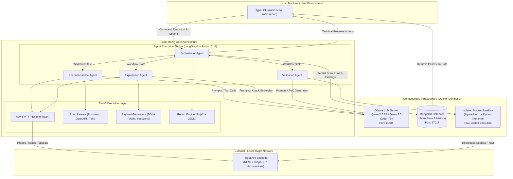
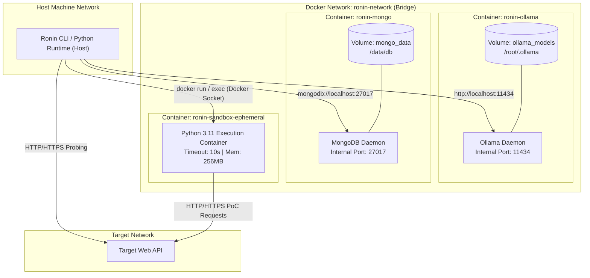
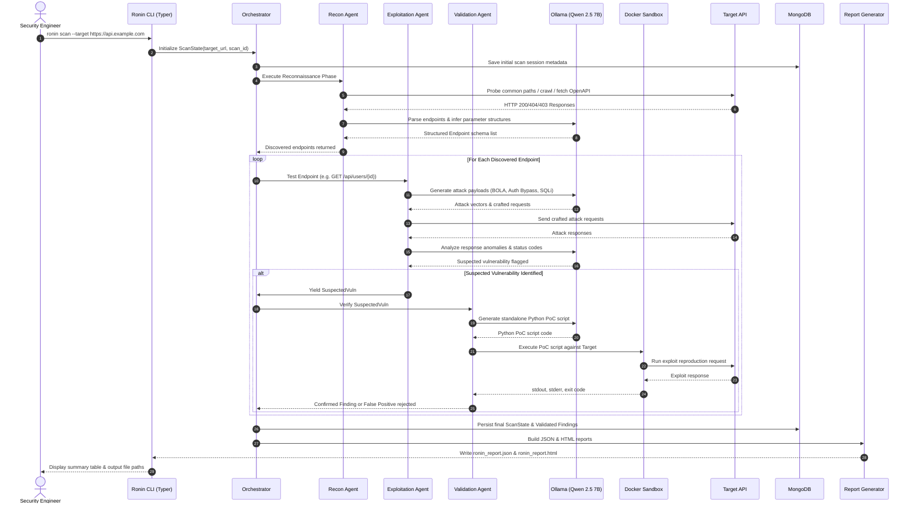

# System Architecture

## 1. High-Level System Overview

**Project Ronin** is an AI-powered, black-box API security testing CLI tool designed to run 100% locally. It combines an autonomous multi-agent orchestration pipeline (built with **LangGraph**) with a locally hosted large language model (**Ollama** running **Qwen 2.5 7B**), an isolated **Docker Sandbox** for safe exploit verification, and **MongoDB** for state persistence and scan audit history.

Ronin operates entirely on-premise without transmitting any target metadata, schema information, or vulnerability findings to external cloud providers.



---

## 2. Component Descriptions

### 2.1 Typer CLI (`cli/main.py`)
The primary interface for security engineers and automated pipelines. Built with **Typer** and **Rich**, it provides:
- **Command Dispatch:** Commands such as `ronin scan` and `ronin report`.
- **Target Specification:** Accepts base target URLs, Postman collections (`--collection`), or raw endpoint lists (`--endpoints`).
- **Scope Configuration:** Supports include (`--include`) and exclude (`--exclude`) URL pattern filtering (glob/regex).
- **Interactive Visuals:** Terminal spinners, step progress bars, colored status badges, and formatted tabular summaries.

### 2.2 Orchestration Engine & LangGraph Pipeline (`agents/`)
The decision-making and execution backbone of Ronin:
- **Stateful Directed Cyclic Graph:** Uses LangGraph to manage execution transitions across agents via a shared, validated `ScanState`.
- **Phased Lifecycle:** Manages sequential execution across **Reconnaissance**, **Exploitation**, **Validation**, and **Reporting**.
- **Fault Recovery:** Implements retry budgets (maximum 2 retries per agent phase failure) and catches network drops or LLM timeouts without terminating the entire test.

### 2.3 Ollama LLM Engine (`core/llm.py`)
The local reasoning engine powering security heuristics:
- **Model:** **Qwen 2.5 Coder 7B** / **Qwen 2.5 7B** served locally over Ollama's HTTP API (`http://localhost:11434`).
- **Function Calling & Heuristics:** Emits structured JSON tool calls and analyzes HTTP responses for logic anomalies, authorization leaks, and sensitive data leakage.
- **Privacy Guarantee:** 100% offline inference with zero data egress.

### 2.4 Persistence Layer — MongoDB (`core/db.py`)
Provides reliable document storage for operational data:
- **Scan Sessions:** Stores scan metadata, configurations, execution parameters, start/end timestamps, and execution phases.
- **Endpoint Catalog:** Stores discovered routes, HTTP methods, parameter schemas, and authentication flags.
- **Findings Repository:** Stores suspected vulnerabilities, confirmed security flaws, CVSS ratings, and full proof-of-concept request/response payloads.

### 2.5 Isolated Docker Sandbox (`tools/sandbox.py`)
A security execution boundary designed to eliminate false positives:
- **Runtime Environment:** Minimal Alpine Linux image configured with Python 3.11 and lightweight HTTP client libraries (`httpx`, `requests`).
- **PoC Script Execution:** Runs autonomous, LLM-generated Python exploit scripts in an isolated container instance with strict memory limits, CPU quotas, execution timeouts (e.g., 10 seconds), and restricted local network privileges.
- **Result Capture:** Captures execution exit codes, standard output (`stdout`), and standard error (`stderr`) to verify exploit reproduction.

### 2.6 Report Engine (`reports/`)
Generates actionable output formats:
- **JSON Exporter (`json_report.py`):** Schema-compliant machine-readable results (`ronin_report.json`) for CI/CD integration and automated ingestion.
- **HTML Exporter (`html_report.py`):** Standalone, interactive HTML report (`ronin_report.html`) rendered with **Jinja2**, containing severity breakdown charts, request/response inspector cards, reproduction steps, and remediation advice with zero external CDN dependencies.

---

## 3. Docker Compose Network Topology

The local infrastructure runs in containerized components defined in `docker-compose.yml`:



### Network Configuration Matrix

| Container / Service | Image | Exposed Port (Host) | Internal Port | Attached Volume | Network Isolation Policy |
|---------------------|-------|---------------------|---------------|-----------------|--------------------------|
| `ronin-ollama` | `ollama/ollama:latest` | `11434:11434` | `11434` | `ollama_models:/root/.ollama` | Bound to `ronin-network`; no internet egress required after model pull. |
| `ronin-mongo` | `mongo:7.0` | `27017:27017` | `27017` | `mongo_data:/data/db` | Internal bridge network; accessible by Ronin Host CLI runtime. |
| `ronin-sandbox` | `ronin-sandbox:latest` | None | None | Ephemeral tmpfs | Restricted access: outbound traffic allowed only to specified target host/IP. |

---

## 4. End-to-End System Data Flow

The lifecycle of a single Ronin execution follows a strict pipeline:



---

## 5. Deployment Model

Ronin is packaged for self-contained, single-machine deployment.

### 5.1 Prerequisites & System Requirements
- **Host OS:** Linux (Ubuntu 22.04+), macOS (Apple Silicon M1/M2/M3 recommended), or Windows 11 (with WSL2).
- **Container Engine:** Docker Engine (v24.0+) and Docker Compose (v2.20+).
- **Hardware Resources:**
  - **Memory (RAM):** Minimum 16 GB (32 GB recommended for 7B Q4_K_M quantization).
  - **GPU (Optional but recommended):** NVIDIA GPU with 8GB+ VRAM (CUDA support) or Apple Silicon Unified Memory for fast token generation.
  - **Storage:** 15 GB available SSD storage (for Ollama model weights and MongoDB data).

### 5.2 Deployment Steps
1. **Infrastructure Initialization:**
   ```bash
   docker compose up -d
   ```
2. **LLM Weight Download:**
   ```bash
   docker exec -it ronin-ollama ollama pull qwen2.5-coder:7b
   ```
3. **Environment Setup & Run:**
   ```bash
   pip install -e .
   ronin scan --target https://target-api.local
   ```
