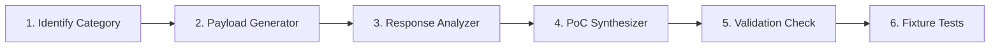

# Contributing Guidelines

Thank you for your interest in contributing to **Project Ronin**! Project Ronin is an open-source, AI-powered black-box API security testing CLI tool designed to autonomously discover, exploit, and validate API vulnerabilities using local LLMs.

To maintain code quality, security, and developer velocity, please review and follow these contribution guidelines before submitting code.

---

## 1. Code Standards & Style

We hold our codebase to strict engineering and security standards. All code must be clean, readable, well-typed, and formatted consistently.

### Formatting & Imports
- **Formatter:** [Black](https://github.com/psf/black) with default 88-character line length.
- **Import Sorting:** [isort](https://pycqa.github.io/isort/) configured with the `black` profile.
- **Linting:** [Flake8](https://flake8.pycqa.org/) with PEP 8 standards.

```bash
# Auto-format code
black .
isort .

# Run linter checks
flake8 ronin tests
```

### Static Typing & Type Hints
- **100% Type Annotation Coverage:** All function parameters, return values, and class attributes must include explicit Python type hints (`typing` / built-in generics).
- **Pydantic Models:** Use Pydantic v2 models for structured schemas, data validation, and LLM state containers.
- **Type Checker:** Code must pass `mypy` with zero warnings:

```bash
mypy ronin
```

### Docstring Standard
Use Google-style docstrings for all modules, classes, and public functions:

```python
def generate_bola_tests(endpoint: Endpoint, id_samples: list[str]) -> list[TestRequest]:
    """Generates BOLA/IDOR test requests by substituting path and query parameters.

    Args:
        endpoint: The target API endpoint schema to test.
        id_samples: A list of candidate object IDs for substitution.

    Returns:
        A list of synthesized TestRequest objects containing manipulated IDs.

    Raises:
        ValueError: If the endpoint has no parameterizable identifiers.
    """
```

---

## 2. Git & Branching Strategy

### Branch Naming Conventions
Always create feature and bugfix branches from `main`. Use descriptive, lowercase names prefixed with the work category:

| Prefix | Use Case | Example |
|--------|----------|---------|
| `feature/` | New functionality or tool | `feature/jwt-none-algorithm-check` |
| `fix/` | Bug fixes and patches | `fix/postman-parser-nested-folders` |
| `docs/` | Documentation additions or updates | `docs/contributing-guide` |
| `refactor/` | Code refactoring without behavior change | `refactor/langgraph-state-pruning` |
| `test/` | Adding or updating test suites | `test/validation-agent-sandbox` |
| `chore/` | Maintenance, dependencies, CI/CD | `chore/update-ollama-dep` |

```bash
git checkout main
git pull origin main
git checkout -b feature/jwt-none-algorithm-check
```

---

## 3. Commit Message Conventions

We adhere to the [Conventional Commits](https://www.conventionalcommits.org/) specification (`<type>(<scope>): <short description>`).

### Commit Types
- `feat`: A new feature or scanner tool.
- `fix`: A bug fix in scanner logic, CLI, or agent flow.
- `docs`: Documentation updates.
- `test`: Adding missing tests or correcting existing tests.
- `refactor`: Code changes that neither fix bugs nor add features.
- `perf`: A code change that improves inference speed or execution performance.
- `chore`: Tooling, dependency, or configuration updates.

### Examples
```text
# Good commit messages
feat(exploit): add BOLA ID enumeration test generator
fix(recon): handle trailing slashes in common path scanner
test(sandbox): add test coverage for Docker script timeout
docs(setup): clarify NVIDIA Container Toolkit installation

# Bad commit messages
updated files
fixed bug
agent changes
WIP
```

---

## 4. Pull Request (PR) Process

1. **Self-Check Before Submitting:**
   - [ ] All unit and integration tests pass (`pytest`).
   - [ ] Linter and formatter checks pass (`black .`, `isort .`, `flake8`, `mypy`).
   - [ ] New agent tools or features include unit tests.
   - [ ] Documentation has been updated if CLI flags or models changed.

2. **PR Description Requirements:**
   Every PR must include:
   - **Summary of Changes:** What was added, fixed, or changed.
   - **Motivation / Context:** Why this change is necessary.
   - **Testing Evidence:** Terminal output or logs showing test pass or successful scan reproduction.
   - **Related Issues:** Link to relevant issue numbers (e.g., `Closes #42`).

3. **Code Review & Merge:**
   - At least one core maintainer approval is required.
   - All CI checks must be green.
   - Branch merges are squashed or rebased to keep git history clean.

---

## 5. Project Architecture Overview

Below is the directory map illustrating component placement:

```
project-ronin/
├── cli/                        # Typer CLI application & terminal UX
│   ├── main.py                 # CLI entry point (scan, report, health-check)
│   └── display.py              # Rich tables, live progress bars, formatted output
├── agents/                     # LangGraph multi-agent definitions
│   ├── orchestrator.py         # Pipeline coordination & routing
│   ├── recon.py                # Scout agent: endpoint mapping & discovery
│   ├── exploit.py              # Attacker agent: test case generation & execution
│   └── validate.py             # Verifier agent: sandbox execution & PoC synthesis
├── tools/                      # Reusable tool implementations called by agents
│   ├── http_client.py          # Async HTTP client wrapper (httpx)
│   ├── parsers.py              # Postman collection, plain text & OpenAPI parsers
│   ├── payloads.py             # BOLA, Auth bypass & injection payload generators
│   ├── analyzers.py            # Response differential analysis & header audits
│   └── sandbox.py              # Docker sandbox execution manager
├── models/                     # Shared Pydantic data schemas
│   ├── state.py                # Global ScanState, Endpoint, SuspectedVuln, Finding
│   └── report.py               # JSON report serializable models
├── reports/                    # Reporting engines
│   ├── json_report.py          # JSON report builder
│   ├── html_report.py          # Jinja2-rendered HTML dashboard builder
│   └── templates/
│       └── report.html.j2      # Standalone responsive HTML/CSS template
├── core/                       # Core system infrastructure
│   ├── config.py               # Settings management via pydantic-settings
│   ├── llm.py                  # Local Ollama client wrapper & ChatML prompt formatting
│   └── db.py                   # MongoDB scan persistence and retrieval
├── wordlists/                  # Curated static dictionaries & payloads
│   ├── common_paths.txt        # High-signal API route discovery dictionary
│   ├── sqli_payloads.txt       # Error-based & boolean SQL injection tests
│   └── xss_payloads.txt        # Reflected parameter test vectors
├── tests/                      # Automated test suite
│   ├── unit/                   # Fast isolated unit tests (mocked I/O)
│   └── integration/            # Multi-agent & container integration tests
├── docker-compose.yml          # Local infra definition (Ollama, MongoDB)
├── Dockerfile.sandbox          # Hardened Alpine execution sandbox container
├── pyproject.toml              # Build system, dependencies, and tool configs
└── README.md                   # Project overview & quickstart
```

---

## 6. How to Add a New Agent Tool (Step-by-Step)

Agent tools are atomic Python functions callable by LangGraph agents to interact with the environment, generate payloads, or analyze data.

### Step 1: Define Input & Output Schemas
In `models/state.py` or relevant tool module, define typed Pydantic models for the tool's input arguments and return payload:

```python
from pydantic import BaseModel, Field

class HeaderAuditInput(BaseModel):
    headers: dict[str, str] = Field(..., description="HTTP response headers to inspect")

class HeaderMisconfiguration(BaseModel):
    header_name: str
    issue: str
    remediation: str
```

### Step 2: Implement the Tool Function
Implement the tool logic inside the appropriate module under `tools/` (e.g., `tools/analyzers.py`):

```python
# tools/analyzers.py
def audit_security_headers(headers: dict[str, str]) -> list[HeaderMisconfiguration]:
    """Audits HTTP response headers for missing or insecure configurations."""
    issues = []
    normalized = {k.lower(): v for k, v in headers.items()}

    if "x-frame-options" not in normalized:
        issues.append(
            HeaderMisconfiguration(
                header_name="X-Frame-Options",
                issue="Missing anti-clickjacking header",
                remediation="Set 'X-Frame-Options: DENY' or 'SAMEORIGIN'."
            )
        )
    return issues
```

### Step 3: Register Tool with the Agent
In `agents/exploit.py` or `agents/recon.py`, register the tool with LangGraph agent node:

```python
# agents/exploit.py
from tools.analyzers import audit_security_headers

def exploit_endpoint_node(state: ScanState) -> ScanState:
    # Execute tool logic during agent node run
    header_issues = audit_security_headers(current_endpoint.sample_response.headers)
    for issue in header_issues:
        state.attack_surface.append(...)
    return state
```

### Step 4: Write Unit Tests
Add unit tests in `tests/unit/test_analyzers.py` to verify functionality without network calls:

```python
def test_audit_security_headers_missing():
    headers = {"Content-Type": "application/json"}
    issues = audit_security_headers(headers)
    assert any(i.header_name == "X-Frame-Options" for i in issues)
```

---

## 7. How to Add a New Vulnerability Check (Step-by-Step)

Follow this workflow to introduce support for a new vulnerability type (e.g., OWASP API2 JWT manipulation, API3 Excessive Data Exposure):



### Step 1: Map to OWASP Category & Update Finding Schema
Ensure the category aligns with the OWASP API Security Top 10 (e.g., `API2:2023 - Broken Authentication`). Ensure `models/state.py` has appropriate severity ratings.

### Step 2: Create Payload / Request Generator
In `tools/payloads.py`, create a deterministic or LLM-guided generator:

```python
def generate_jwt_none_algorithm_tests(base_token: str) -> list[str]:
    """Generates modified JWTs with alg: none and empty signature."""
    # Split token, modify header to {"alg": "none", "typ": "JWT"}, rebuild without signature
    ...
```

### Step 3: Add Heuristic / LLM Response Analysis
In `tools/analyzers.py`, create the evaluator that distinguishes valid responses from authentication errors:

```python
def evaluate_auth_bypass_response(baseline_code: int, test_code: int, test_body: str) -> bool:
    """Returns True if the response indicates bypass (e.g., HTTP 200 with sensitive data)."""
    return baseline_code == 401 and test_code == 200
```

### Step 4: Add Validation Script Generation
In `agents/validate.py`, define the PoC template or prompt instructions so the Validation Agent can generate a standalone Python script reproducing the flaw.

### Step 5: Test with Mock Target
Add an automated test in `tests/integration/test_vuln_detection.py` simulating the vulnerability against a mock HTTP server.

---

## 8. Testing Requirements

All contributions must meet our automated testing standards.

### Test Categories
1. **Unit Tests (`tests/unit/`):**
   - Must run in seconds.
   - Mock all external network calls using `respx` or `unittest.mock`.
   - Mock LLM responses using deterministic ChatML JSON strings.
2. **Integration Tests (`tests/integration/`):**
   - Test LangGraph agent state transitions and graph compilation.
   - Test Docker sandbox isolation and timeout handling.

### Running Test Suites

```bash
# Run unit tests only
pytest tests/unit -v

# Run with coverage report
pytest --cov=ronin --cov-report=html

# Target minimum code coverage
# All PRs must maintain at least 80% line coverage across tools/ and agents/.
```

---

## 9. Getting Help & Code of Conduct

- **Questions & Discussions:** Join our GitHub Discussions board or open an issue.
- **Reporting Security Issues:** Please do NOT open public issues for security flaws in Project Ronin itself. Email `security@projectronin.dev` directly.
- **Respect & Collaboration:** Be constructive, inclusive, and professional in all communications.
