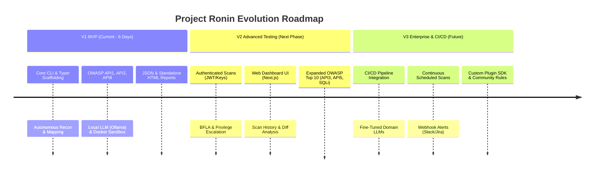
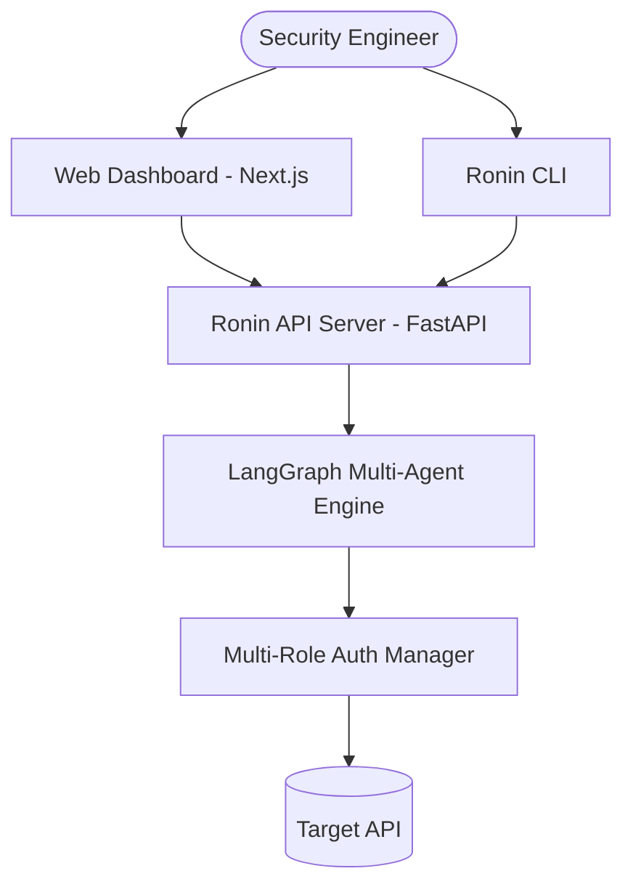

# Project Milestones & Product Roadmap

This document outlines the phased milestone roadmap for **Project Ronin**, detailing the evolution from the initial 6-day MVP (V1) to advanced enterprise-ready continuous API security testing capabilities (V2 & V3).

---

## 1. Roadmap Overview & Comparison Matrix



### Feature Comparison Across Milestones

| Capability / Feature | V1 (MVP) | V2 (Advanced) | V3 (Enterprise) |
|:---|:---:|:---:|:---:|
| **Interface** | Typer CLI + Rich Terminal | CLI + Web Dashboard (Next.js) | CLI, Web UI & REST API Service |
| **Execution Environment** | 100% Local (Ollama + Docker) | Local + Hybrid Remote GPU | Distributed Workers / Kubernetes |
| **Target Scope** | Public APIs & Unauth Bypasses | Multi-User Authenticated APIs | Cloud Estates & Microservices |
| **Authentication Support** | Active Auth Bypass / Token Fuzzing | Bearer, API Keys, Cookies, OAuth2 | Multi-Role Session Matrix & SSO |
| **Vulnerability Categories** | BOLA, Broken Auth, Misconfig (3) | Full OWASP Top 10 + Injections (7) | Zero-day Heuristics & Custom Plugins |
| **Validation Mechanism** | Docker Sandbox Python PoC | Multi-Container Sandbox + Replay | Distributed Sandboxes + Safe Fuzzing |
| **Reporting** | JSON + Standalone HTML | Interactive Dashboard + PDF | Jira Sync, DefectDojo, SARIF Export |
| **CI/CD Automation** | Manual CLI Execution | GitHub Actions Baseline | Native CI Blocking & Policy Gates |
| **AI Model Tier** | `qwen2.5-coder:7b` via Ollama | Quantized 7B/14B with LoRA | Fine-tuned Sec-LLM on API Datasets |

---

## 2. Milestone V1: Core Autonomous Scanner (Current - 6 Days)

### Summary
The V1 milestone delivers a standalone, privacy-preserving, black-box API security testing CLI tool. It autonomously maps targets, tests for critical authorization flaws, and validates discoveries in a sandbox before producing executive and developer reports.

### Target Release
Sprint Day 6.

### Key Features Included
1. **Autonomous Reconnaissance & Ingestion:**
   - Wordlist-based active discovery for common API routes and documentation endpoints.
   - Postman v2.1 collection parser and plain text route list ingestion.
   - Automatic Swagger / OpenAPI 2.0 & 3.0 detection and specification parsing.
2. **Core Vulnerability Scanning (OWASP API Security Top 3):**
   - **API1:2023 (BOLA / IDOR):** Object identifier substitution, numeric enumeration, and path parameter mutation to identify unauthorized object access.
   - **API2:2023 (Broken Authentication):** Unauthenticated endpoint discovery, missing authorization header checks, and JWT `alg: none` validation.
   - **API8:2023 (Security Misconfiguration):** Inspection of security headers (`CORS`, `CSP`, `X-Frame-Options`), verb tampering (HTTP method testing), and stack trace disclosure detection.
3. **Local Multi-Agent Orchestration:**
   - Four distinct LangGraph agents: Orchestrator, Recon (Scout), Exploit (Attacker), and Validation (Verifier).
   - 100% local inference powered by `qwen2.5-coder:7b` through Ollama.
4. **False-Positive Elimination via Sandbox:**
   - Isolated Docker container (`Dockerfile.sandbox`) executing dynamically generated Python exploit scripts.
   - Findings confirmed only upon successful PoC execution.
5. **Comprehensive Reporting:**
   - Structured `ronin_report.json` for machine consumption.
   - Self-contained, responsive `ronin_report.html` with interactive charts and reproduction steps.
   - MongoDB scan persistence for session tracking.

### Success Criteria
- [ ] Successfully executes against target APIs without crashes.
- [ ] Correctly identifies and validates seeded vulnerabilities in OWASP crAPI and vAPI test environments.
- [ ] Generates valid JSON and HTML reports with reproduction code.
- [ ] Operates with zero network calls to external AI providers.

### Deliverables
- `ronin` CLI executable (`pip install -e .`).
- `docker-compose.yml` defining local Ollama and MongoDB services.
- Hardened `Dockerfile.sandbox` image.
- Complete documentation suite.

---

## 3. Milestone V2: Authenticated Testing & Web Dashboard (Next Phase)

### Summary
Milestone V2 expands Project Ronin into multi-tenant, authenticated API security testing, allowing security teams to discover privilege escalation vulnerabilities between different user roles, while introducing a modern Web UI for visualizing findings.

### Target Scope & Architecture



### Key Features Included
1. **Multi-Role Authentication Engine:**
   - Support for user-supplied authentication tokens: Bearer JWTs, static API keys, session cookies, and basic auth headers.
   - Multi-role credential matrix (e.g. `Admin`, `Member`, `Guest`, `Anonymous`) for cross-user permission validation.
2. **Advanced Authorization & Business Logic Attacks:**
   - **API5:2023 (Broken Function Level Authorization - BFLA):** Cross-role endpoint access (e.g. standard user calling `/api/v1/admin/users`).
   - **API3:2023 (Excessive Data Exposure):** LLM-assisted PII and sensitive key detection in response bodies.
   - **Injection Testing:** Basic SQLi and cross-site scripting payload injection across query parameters and JSON payloads.
3. **Interactive Web Dashboard:**
   - Next.js / React web interface for initiating scans, viewing real-time agent thoughts, and managing target assets.
   - Live vulnerability triage, status management (Open, Fixed, False Positive), and search/filtering.
4. **Historical Diffing & Regression Tracking:**
   - Compare scan results across builds or deployment dates.
   - Track vulnerability remediation velocity and flag newly introduced security regressions.
5. **Batch Scanning:**
   - Ability to supply a list of target base URLs or multi-service microservice meshes for concurrent testing.

### Success Criteria
- [ ] Accurately detects BFLA flaws where lower-privileged user credentials access administrative endpoints.
- [ ] Web dashboard connects to Ronin backend and displays live scan progress and historical charts.
- [ ] Scan comparison engine accurately flags resolved and recurring vulnerabilities between two runs.

### Deliverables
- Ronin REST API backend service (`FastAPI`).
- Web frontend dashboard (`apps/dashboard`).
- Authenticated scanning module and multi-role test engine.

---

## 4. Milestone V3: CI/CD Integration & Enterprise Ecosystem (Future)

### Summary
Milestone V3 transitions Project Ronin into a continuous DevSecOps platform, integrating directly into enterprise build pipelines, featuring domain-specialized LLM models, scheduled recurring scans, and third-party security ecosystem integrations.

### Key Features Included
1. **DevSecOps & CI/CD Pipeline Automation:**
   - Native GitHub Actions, GitLab CI, and Jenkins integration plugins.
   - Configurable security quality gates (e.g. fail pull requests if any `CRITICAL` or `HIGH` vulnerabilities are validated).
   - SARIF (Static Analysis Results Interchange Format) output generation for GitHub Code Scanning integration.
2. **Domain-Specific Fine-Tuned Security LLMs:**
   - Fine-tuned local models (LoRA / specialized weights) trained on curated API vulnerability datasets, reducing token usage and inference latency while boosting exploit synthesis accuracy.
3. **Continuous Monitoring & Scheduled Scans:**
   - Background cron-like scheduler for periodic testing of staging and production endpoints.
   - Drift detection when API schemas change without updated security tests.
4. **Enterprise Ecosystem & Incident Alerts:**
   - Automated ticket creation in Jira, Linear, and GitHub Issues.
   - Alert notifications via Slack, Microsoft Teams, Discord, and PagerDuty.
   - Export integrations with vulnerability management platforms (DefectDojo, ThreadFix).
5. **Custom Plugin SDK & Community Rule Engine:**
   - Python / YAML plugin architecture enabling internal security teams to write organization-specific compliance rules and attack heuristics.

### Success Criteria
- [ ] GitHub Action successfully blocks a PR containing an intentionally vulnerable endpoint within a CI run.
- [ ] SARIF report displays findings directly in GitHub Security tab.
- [ ] Fine-tuned model achieves 30%+ faster inference and higher PoC synthesis success rate compared to generic base models.

### Deliverables
- Official GitHub Action (`actions/ronin-scan`).
- Plugin SDK package (`ronin-sdk`).
- Fine-tuning scripts, dataset preparation pipelines, and model adapters.

---

## 5. Architectural Evolution Across Milestones

```
┌────────────────────────────────────────────────────────────────────────┐
│                               V1 (MVP)                                 │
│  Typer CLI ──► LangGraph Engine ──► Ollama (Qwen 7B) ──► Docker Sandbox│
│                      │                                                 │
│                      ▼                                                 │
│             JSON & HTML Reports                                        │
└───────────────────────────────────┬────────────────────────────────────┘
                                    │
                                    ▼
┌────────────────────────────────────────────────────────────────────────┐
│                               V2 (Advanced)                            │
│  Web UI / CLI ──► FastAPI API ──► Multi-Role Engine ──► Diff History   │
│                      │                                                 │
│                      ▼                                                 │
│             Dashboard & PDF Exports                                    │
└───────────────────────────────────┬────────────────────────────────────┘
                                    │
                                    ▼
┌────────────────────────────────────────────────────────────────────────┐
│                              V3 (Enterprise)                           │
│  CI/CD Actions ──► Distributed Workers ──► Fine-Tuned Sec LLM          │
│                      │                                                 │
│                      ▼                                                 │
│             Jira / Slack / SARIF / Scheduled Scans                     │
└────────────────────────────────────────────────────────────────────────┘
```
