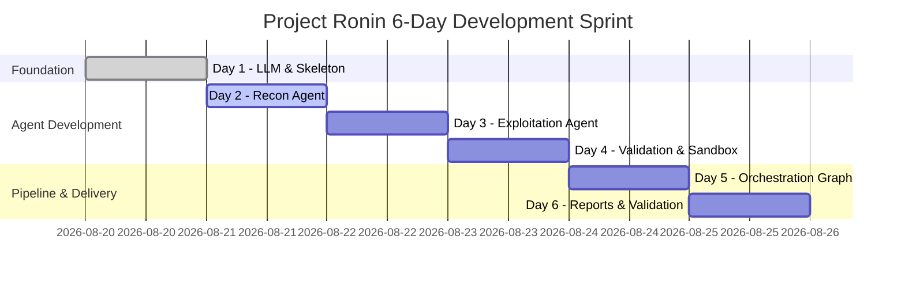

# Development Timeline & Sprint Plan

**Project Ronin** is structured as an intensive, milestone-driven 6-day sprint to deliver a fully functional, localized, AI-powered black-box API security testing CLI tool.

---

## 1. High-Level Sprint Schedule (6 Days)

| Day | Focus Area | Core Deliverables | Success Metric |
|:---:|:-----------|:------------------|:---------------|
| **Day 1** | **LLM Integration & Project Skeleton** | Ollama container, Typer CLI skeleton, project structure, config management | `ronin health-check` returns all green; local Ollama prompts succeed. |
| **Day 2** | **Recon Agent (Scout)** | Postman/text parsers, common path scanner, OpenAPI auto-detection, HTTP client | Given base URL or collection, Ronin outputs structured endpoint inventory. |
| **Day 3** | **Exploitation Agent (Attacker)** | BOLA/IDOR tests, auth bypass generator, header audit, LLM response analysis | Given endpoint list, Ronin generates and executes attacks, flagging suspected vulns. |
| **Day 4** | **Validation Agent & Sandbox** | Docker sandbox (`Dockerfile.sandbox`), PoC script generator, verification loop | Suspected vulnerabilities verified via isolated PoC execution; false positives eliminated. |
| **Day 5** | **Orchestrator & LangGraph Flow** | LangGraph state graph, multi-agent routing, retry/error handling, MongoDB persistence | Full autonomous scan cycle executes end-to-end from single CLI command. |
| **Day 6** | **Reports, Testing & Polish** | JSON + HTML report generators, Rich CLI UI, crAPI/vAPI integration benchmark, docs | Full scan against vulnerable testbed outputs valid JSON and standalone HTML report. |

---

## 2. Detailed Daily Sprint Breakdown

---

### Day 1: LLM Integration & Project Skeleton

#### Objective
Establish the foundational infrastructure, configuration management, local LLM serving pipeline, and CLI entry point.

#### Tasks Breakdown
- [ ] Initialize Python repository structure, `pyproject.toml`, and virtual environment tooling.
- [ ] Create `docker-compose.yml` configuring `ai_engine` (Ollama), `mongodb`, and network bindings.
- [ ] Pull and verify `qwen2.5-coder:7b` model within the containerized Ollama instance.
- [ ] Implement `core/config.py` using `pydantic-settings` for `.env` loading and environment defaults.
- [ ] Build `core/llm.py` client wrapper with ChatML prompt formatting, structured JSON output enforcement, and fallback parsing.
- [ ] Scaffolding CLI in `cli/main.py` using Typer with `scan`, `report`, and `health-check` commands.
- [ ] Establish MongoDB client connection and state schema models in `core/db.py` and `models/state.py`.

#### Deliverables
- Functional `docker-compose.yml` and `.env.example`.
- Working `ronin health-check` command verifying all services.
- `OllamaClient` class able to stream responses and return validated Pydantic models.

#### Acceptance Criteria
- Running `ronin --version` outputs CLI version string.
- Running `ronin health-check` checks Python, Docker, Ollama, MongoDB, and reports connectivity.
- Python unit test verifies structured JSON extraction from local `qwen2.5-coder:7b`.

#### Dependencies
- Docker Engine & NVIDIA drivers (if using GPU).

---

### Day 2: Recon Agent (Scout)

#### Objective
Build the discovery engine capable of ingesting external API specifications or discovering endpoints dynamically via black-box crawling and fuzzing.

#### Tasks Breakdown
- [ ] Implement async HTTP client in `tools/http_client.py` using `httpx` with connection pooling, retries, and rate limiting.
- [ ] Create `tools/parsers.py`:
  - `parse_postman_collection(file_path)`: Extract paths, methods, query parameters, headers, and request bodies from Postman v2.1 JSON.
  - `parse_text_endpoints(file_path)`: Extract HTTP method and route from plain text lines (e.g., `GET /api/v1/users`).
  - `parse_openapi_from_response(body)`: Parse Swagger 2.0 / OpenAPI 3.0 specs.
- [ ] Build `tools/common_paths.txt` wordlist with top 150 high-signal API prefixes (`/api`, `/v1`, `/swagger.json`, `/health`, `/metrics`, etc.).
- [ ] Implement `tools/discovery.py` common path probing with status code classification (200, 401, 403, 405).
- [ ] Implement `agents/recon.py` encapsulating the Recon Agent logic and updating `ScanState.discovered_endpoints`.

#### Deliverables
- Complete parsing suite for Postman collections, plain text, and OpenAPI specs.
- Active endpoint discovery module with concurrent path probing.
- `ReconAgent` outputting normalized `list[Endpoint]` objects.

#### Acceptance Criteria
- Given a Postman collection JSON, all routes, query params, and body templates are parsed into `Endpoint` models with 100% fidelity.
- Given a live base URL hosting Swagger UI or common endpoints, `ReconAgent` discovers and catalogs available routes.

#### Dependencies
- Day 1 project skeleton and HTTP client wrapper.

---

### Day 3: Exploitation Agent (Attacker)

#### Objective
Develop the vulnerability scanning engine targeting core OWASP API Security categories (BOLA/IDOR, Broken Authentication, and Security Misconfigurations).

#### Tasks Breakdown
- [ ] Build payload generators in `tools/payloads.py`:
  - `generate_bola_tests()`: Numeric ID increment/decrement, UUID swap, parameter manipulation (`id`, `user_id`, `account_id`).
  - `generate_auth_bypass_tests()`: Header omission, JWT `alg: none` manipulation, expired token injection, default credential headers.
  - `generate_injection_payloads()`: SQLi error payloads (`' OR '1'='1`), XSS probe strings, command injection canaries.
- [ ] Implement `tools/analyzers.py`:
  - `check_security_headers()`: Missing `CORS`, `CSP`, `X-Frame-Options`, `HSTS`, `X-Content-Type-Options`.
  - `detect_verbose_errors()`: Stack traces, internal file paths, framework signatures in error responses.
  - `analyze_differential_response()`: Compare baseline vs test response body structure and status code.
- [ ] Build LLM reasoning module in `agents/exploit.py`: Prompt `qwen2.5-coder:7b` with endpoint metadata and HTTP responses to determine vulnerability probability.
- [ ] Populate `ScanState.attack_surface` with flagged `SuspectedVuln` items.

#### Deliverables
- Test generation engines for API1 (BOLA), API2 (Broken Auth), and API8 (Security Misconfiguration).
- Differential response analyzer and LLM-assisted vulnerability detector.
- `ExploitAgent` node processing each endpoint iteratively.

#### Acceptance Criteria
- Scanner accurately flags BOLA when different object IDs return HTTP 200 with distinct object payloads without authorization.
- Scanner detects endpoints accepting requests when `Authorization` header is removed.
- Scanner flags missing security headers and stack trace disclosures.

#### Dependencies
- Day 2 `Endpoint` model and HTTP client.

---

### Day 4: Validation Agent & Sandbox

#### Objective
Eliminate false positives by synthesizing standalone Python exploit scripts and executing them in an isolated Docker container sandbox.

#### Tasks Breakdown
- [ ] Author hardened `Dockerfile.sandbox`:
  - Minimal Alpine Linux base with Python 3.11, `httpx`, `requests`.
  - Non-root unprivileged execution user.
  - Strict resource quotas: CPU ceiling, 256MB RAM limit, 15-second execution timeout.
- [ ] Build `tools/sandbox.py` using Docker SDK for Python:
  - Safe container instantiation, ephemeral volume mounting, stdout/stderr capture, exit code tracking.
- [ ] Develop PoC synthesis prompt in `agents/validate.py`: Instruct `qwen2.5-coder:7b` to write self-contained Python scripts returning exit code `0` on successful reproduction.
- [ ] Implement validation loop:
  - Run synthesized PoC script inside sandbox against the target.
  - Verify reproduction: If exit code `0` and expected condition is met, mark as `validated_findings`.
  - If script fails or times out, trigger 1 retry or discard as false positive.

#### Deliverables
- `Dockerfile.sandbox` and `SandboxRunner` management class.
- PoC synthesis prompt template for Python exploit generation.
- `ValidationAgent` filtering `attack_surface` into confirmed `validated_findings`.

#### Acceptance Criteria
- Sandbox safely executes Python scripts and enforces 15-second timeouts without leaking host resources.
- Confirmed vulnerabilities contain a runnable Python PoC script in finding metadata.
- False positive test cases (e.g. simulated 404/500 responses) are successfully rejected.

#### Dependencies
- Day 1 Docker environment and Day 3 `SuspectedVuln` model.

---

### Day 5: Orchestrator & LangGraph Integration

#### Objective
Unify all agents into a robust, resilient LangGraph state machine with deterministic routing, error recovery, and persistence.

#### Tasks Breakdown
- [ ] Define global `ScanState` schema in `models/state.py` with full type annotations.
- [ ] Build LangGraph workflow in `agents/orchestrator.py`:
  - Define nodes: `recon_node`, `exploit_node`, `validate_node`, `report_node`.
  - Define conditional edges: routing based on remaining endpoints and suspected vulns.
- [ ] Implement state pruning logic: Condense large response bodies before passing state to LLM prompts to prevent context window overflow.
- [ ] Implement error handling and retry mechanism (maximum 2 retries per failing node before graceful fallback).
- [ ] Integrate MongoDB checkpointing: Save scan snapshots at each phase transition.
- [ ] Connect Typer CLI command `ronin scan` directly to the compiled LangGraph workflow.

#### Deliverables
- Fully compiled LangGraph workflow managing the end-to-end testing lifecycle.
- State persistence and crash-recovery logic using MongoDB.
- Complete CLI scan execution pipeline.

#### Acceptance Criteria
- Running `ronin scan --target https://api.target.com` executes Recon -> Exploit -> Validate -> Report without manual intervention.
- Agent failures or transient HTTP timeouts are retried up to 2 times without crashing the main process.

#### Dependencies
- Day 1 through Day 4 agent implementations and schemas.

---

### Day 6: Reports, Testing & Polish

#### Objective
Generate professional JSON and HTML security reports, provide live CLI terminal progress, benchmark against intentionally vulnerable APIs, and finalize documentation.

#### Tasks Breakdown
- [ ] Implement JSON report generator in `reports/json_report.py` adhering to the V1 schema (summary, CVSS scores, PoC snippets, remediation).
- [ ] Create standalone HTML report in `reports/html_report.py` with Jinja2 template (`reports/templates/report.html.j2`):
  - Inline CSS/JS (no external CDN requirements for air-gapped environments).
  - Interactive severity charts, expandable PoC reproduction details, search/filter bar.
- [ ] Build terminal UI in `cli/display.py` with `rich`: Live spinner, progress bar per endpoint, ASCII results summary table.
- [ ] Test and benchmark Project Ronin against intentionally vulnerable testbeds:
  - [OWASP crAPI](https://github.com/OWASP/crAPI)
  - [vAPI](https://github.com/roottusk/vapi)
- [ ] Finalize documentation, installation guides, sample reports, and README.

#### Deliverables
- Production-ready JSON and HTML reporting pipeline.
- Rich terminal UI with real-time feedback.
- Verified test suite and benchmark results against crAPI/vAPI.
- Complete user and developer documentation.

#### Acceptance Criteria
- JSON and HTML reports are written to `./ronin_runs/<scan_id>/` upon scan completion.
- HTML report opens cleanly in any modern browser without external internet access.
- Ronin successfully identifies and validates at least 2 real vulnerabilities in crAPI/vAPI test environments.

#### Dependencies
- Completed LangGraph pipeline from Day 5.

---

## 3. Risk Register & Mitigations

| Risk ID | Risk Description | Likelihood | Impact | Mitigation Strategy |
|:-------:|:-----------------|:----------:|:------:|:--------------------|
| **R-01** | **LLM Hallucination in Payload Generation** | High | Medium | Use strict Pydantic JSON schemas, temperature `0.1`, and validate generated payloads with deterministic regex before sending. |
| **R-02** | **Context Window Exhaustion (8k Limit)** | Medium | High | Prune HTTP bodies and state history in `Orchestrator` before sending prompts; extract only status codes, headers, and relevant JSON slices. |
| **R-03** | **Sandbox Execution Hangs or Freezes** | Medium | High | Enforce hard timeout (15s) at the Docker container level via Docker SDK `timeout` and cgroups memory limits (`256m`). |
| **R-04** | **Target API Rate Limiting / DoS** | Medium | Medium | Implement configurable request concurrency (`MAX_CONCURRENT_REQUESTS=10`) and dynamic delay throttling in `tools/http_client.py`. |
| **R-05** | **Ollama Model Loading Latency** | Low | Medium | Pre-warm model during `ronin health-check` or scan initialization with an empty prompt; set `keep_alive: "1h"`. |
| **R-06** | **High False Positive Rate** | High | High | Mandatory validation phase: no finding is marked as confirmed unless verified by isolated Python script execution in sandbox. |

---

## 4. Definition of Done (DoD) for V1

A task or milestone is considered **Done** for Project Ronin V1 when all of the following conditions are satisfied:

1. **Functional Coverage:**
   - [ ] Auto-discovery via common path crawling and Postman/text file parsing operational.
   - [ ] Vulnerability scanning operational for OWASP API1 (BOLA), API2 (Broken Auth), and API8 (Security Misconfiguration).
   - [ ] Validation sandbox executes PoC scripts and filters unconfirmed findings.
2. **Local & Privacy-Preserving Execution:**
   - [ ] 100% local execution using Ollama (`qwen2.5-coder:7b`) with zero cloud API keys or external LLM dependencies.
3. **Reporting & Artifacts:**
   - [ ] Structured `ronin_report.json` and standalone `ronin_report.html` generated per scan.
   - [ ] Terminal UI displays real-time progress and summary table.
4. **Code Quality & Stability:**
   - [ ] Code formatted with `black`, `isort`, and passes `flake8`.
   - [ ] Strict type annotations passing `mypy` with zero errors.
   - [ ] Unit and integration test suite passing with >= 80% coverage on core tools.
5. **Documentation:**
   - [ ] Setup guide, contributing guidelines, timeline, and milestones fully documented.
