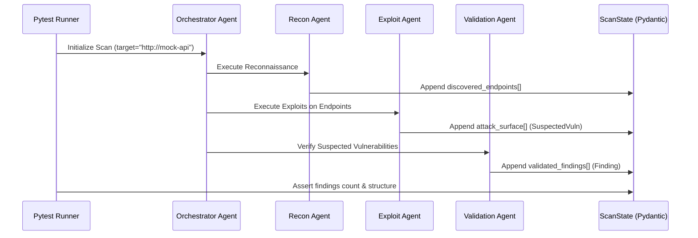

# Testing Strategy & Plan

**Project:** Project Ronin — AI-Powered Black-Box API Security Testing CLI  
**Document Version:** 1.0.0  
**Target Architecture:** V1 Local Multi-Agent Execution  

---

## 1. Overview & Objectives

Project Ronin combines deterministic Python tooling, asynchronous HTTP probing, containerized Docker sandboxing, and local LLM-driven multi-agent orchestration. Because security tooling requires extreme reliability—preventing false positives, avoiding out-of-scope executions, and ensuring consistent vulnerability detection—a comprehensive, multi-tiered testing strategy is essential.

This test plan defines the testing levels, methodologies, test targets, mock fixtures, and validation criteria for Project Ronin V1, concluding with the continuous integration roadmap.

```
                   /\
                  /  \
                 / E2E\           Level 3: Full Pipeline vs Real Targets (crAPI, vAPI)
                /------\
               / Integr \         Level 2: Independent Agent Workflows (LangGraph)
              /----------\
             /    Unit    \       Level 1: Tool Functions, Parsers, AST, Payloads
            /--------------\
```

---

## 2. Testing Levels & Matrix

| Level | Scope | Primary Objective | Execution Speed | Dependencies |
| :--- | :--- | :--- | :--- | :--- |
| **Level 1: Unit Tests** | Individual functions, models, and utility tools | Verify correctness of parsers, payload generators, AST static checkers, and analyzers in isolation. | < 5 seconds | None (Pure Python, memory-only) |
| **Level 2: Integration Tests** | Single Agent workflows & Agent-to-Agent state transitions | Ensure LangGraph state transitions, mock LLM interactions, tool calls, and MongoDB persistence behave deterministically. | ~10–30 seconds | Mock LLM / Respx, Local MongoDB |
| **Level 3: End-to-End (E2E) Tests** | Full scan pipeline from CLI input to final JSON/HTML report generation | Validate vulnerability discovery and zero false-positive confirmation against live vulnerable API targets. | 2–5 minutes | Ollama, Docker Sandbox, Live Target API |

---

## 3. Detailed Testing Specifications

### 3.1 Level 1: Unit Testing

Unit tests focus on the deterministic building blocks located in `tools/`, `models/`, and `core/`.

```
project-ronin/tests/unit/
├── test_parsers.py          # Postman, plain text, OpenAPI/Swagger parsers
├── test_http_client.py      # Async HTTP request wrapper, timeouts, redirects
├── test_payloads.py         # BOLA mutations, auth bypass tokens, injection strings
├── test_analyzers.py        # Header validation, diff engine, regex analyzers
├── test_sandbox_ast.py      # AST pre-validator and unsafe module filters
└── test_models.py           # Pydantic schema validation & serialization
```

#### Key Unit Test Scenarios:

1. **API Document Parsers (`tools/parsers.py`)**
   - **Postman Parser:** Validates parsing of Postman Collection v2.0 and v2.1 schemas, extracting methods, base URLs, path variables, query parameters, and headers.
   - **Text Parser:** Validates newline-delimited endpoint strings (`METHOD /path`), gracefully handling comments (`#`), whitespace, and malformed lines.
   - **OpenAPI / Swagger Parser:** Extracts paths, path parameters, and request bodies from Swagger 2.0 and OpenAPI 3.0.x JSON/YAML files.

2. **HTTP Client Wrapper (`tools/http_client.py`)**
   - Ensures non-2xx status codes are handled without uncaught exceptions.
   - Verifies timeout enforcement (10-second ceiling).
   - Validates that cross-domain redirects are stripped to prevent out-of-scope traversal.

3. **Payload Generators (`tools/payloads.py`)**
   - **BOLA Generator:** Verifies ID mutation logic (numeric increment/decrement, GUID swapping, zero-state testing).
   - **Auth Bypass Generator:** Generates unsigned JWTs (`alg:none`), strips `Authorization` headers, and crafts common default credential headers.
   - **Injection Generator:** Returns contextual SQLi/XSS payloads tailored to parameter data types (strings vs. integers).

4. **Response Analyzers & Security Checks (`tools/analyzers.py`)**
   - Verifies missing security header detection (`Strict-Transport-Security`, `Content-Security-Policy`, `X-Content-Type-Options`, `X-Frame-Options`, `Access-Control-Allow-Origin: *`).
   - Verifies differential comparison logic between authorized and unauthorized responses.

5. **Sandbox AST Static Analyzer (`tools/sandbox.py`)**
   - Verifies rejection of dangerous imports (`os`, `subprocess`, `sys`, `socket`).
   - Verifies approval of safe HTTP scripts using `httpx` or `requests`.

---

### 3.2 Level 2: Agent Integration Testing

Integration tests verify that each LangGraph agent executes its specialized role and properly mutates the shared `ScanState`.

```
project-ronin/tests/integration/
├── test_recon_agent.py      # Scout: Discovers endpoints and updates state
├── test_exploit_agent.py    # Attacker: Flags suspected vulnerabilities
├── test_validate_agent.py   # Verifier: Generates PoC and executes in sandbox
├── test_orchestrator.py     # Router: Coordinates phase transitions and retries
└── test_db_persistence.py  # Mongo state saving and retrieval
```



#### Key Integration Test Scenarios:

1. **Recon Agent Test:**
   - Input: Mock base URL serving `/swagger.json` and a `/health` endpoint.
   - Assertion: `ScanState.discovered_endpoints` contains parsed endpoints with correct HTTP methods and parameters.
2. **Exploitation Agent Test:**
   - Input: Mock endpoint `GET /api/users/{id}` returning sensitive data without auth.
   - Mock LLM: Returns identified BOLA vulnerability hypothesis.
   - Assertion: `ScanState.attack_surface` contains a structured `SuspectedVuln` object.
3. **Validation Agent Test:**
   - Input: `SuspectedVuln` for BOLA.
   - Execution: Synthesizes PoC, validates AST, executes inside Docker sandbox against mock server.
   - Assertion: PoC exits with code 0, confirms vulnerability, and updates `ScanState.validated_findings`.
4. **Orchestrator Resilience & Error Handling:**
   - Simulates agent exceptions and validates that the orchestrator retries up to 2 times before logging an error to `ScanState.errors` and continuing.

---

### 3.3 Level 3: End-to-End (E2E) Testing

End-to-End tests execute the complete Ronin pipeline via CLI against live and containerized intentionally vulnerable target APIs.

#### Testbed Targets:

1. **OWASP crAPI (Completely Ridiculous API):**
   - Repository: `https://github.com/OWASP/crAPI`
   - Deployment: Multi-container microservices application (Auth, Community, Identity, Workshop services).
   - Focus: BOLA on vehicle location and community posts, Broken Authentication on password reset / OTP, Mass Assignment.
2. **vAPI (Vulnerable API):**
   - Repository: `https://github.com/roottusk/vapi`
   - Focus: OWASP API Security Top 10 exercises, token tampering, user ID enumeration.
3. **Ronin Mock API (Custom FastAPI Testbed):**
   - Lightweight, deterministic test fixture running in Docker for rapid regression tests.
   - Contains exactly 1 BOLA vulnerability, 1 Broken Auth endpoint, 1 Missing Header endpoint, and 2 secure endpoints.

---

## 4. Test Fixtures & Sample Data

All test fixtures are stored under `tests/fixtures/` and are version-controlled:

```
project-ronin/tests/fixtures/
├── collections/
│   ├── sample_v21_collection.json     # Multi-folder Postman collection with params
│   └── malformed_collection.json      # Invalid JSON for error handling
├── endpoints/
│   ├── standard_endpoints.txt         # 15 typical REST endpoints
│   └── dirty_endpoints.txt            # Endpoints with whitespace, tabs, and comments
├── openapi/
│   ├── petstore_openapi.json          # Standard OpenAPI 3.0 specification
│   └── crapi_swagger.json             # crAPI Swagger definition
├── responses/
│   ├── bola_user_1.json               # Baseline response
│   ├── bola_user_2.json               # Unauthorized accessed object
│   └── stack_trace_error.html         # Verbose 500 error page
└── mock_llm/
    ├── recon_responses.json           # Deterministic LLM endpoint extractions
    ├── exploit_hypotheses.json        # Deterministic exploit attack plans
    └── poc_scripts.json               # Deterministic Python PoC scripts
```

---

## 5. Success Criteria & Quality Gates

For a build or release to pass acceptance testing, Project Ronin must satisfy the following benchmarks:

| Criterion | Target Metric | Verification Method |
| :--- | :--- | :--- |
| **crAPI Vulnerability Detection** | $\ge 3$ distinct vulnerabilities | Detects BOLA (Community/Vehicle), Broken Auth, and Security Misconfiguration on live crAPI. |
| **False Positive Rate** | $0\%$ in `validated_findings` | All reported findings must reproduce successfully via verified PoC scripts. |
| **Unit Test Code Coverage** | $\ge 85\%$ | `pytest --cov=agents --cov=tools --cov=core` |
| **AST Sandbox Safety Gate** | $100\%$ interception | Zero unsafe scripts (containing `os.system`, `subprocess`, etc.) allowed into execution sandbox. |
| **Scope Confinement** | $100\%$ compliance | Zero outbound HTTP requests dispatched to unlisted domains or private IP ranges. |
| **Report Generation** | $100\%$ valid schema | Output `report.json` passes JSONSchema validation; `report.html` renders without JS errors. |

---

## 6. Testing Toolchain & Environment Setup

### Required Tooling:
- **`pytest`**: Test runner and execution framework.
- **`pytest-asyncio`**: Asynchronous test execution for `httpx` and LangGraph coroutines.
- **`pytest-cov`**: Code coverage reporter.
- **`pytest-mock`**: Fixtures and mocking utilities.
- **`respx` / `pytest-httpx`**: HTTP request mocking and simulation.
- **Docker Compose**: Orchestration of test targets (crAPI, Mock API, Ollama, MongoDB).

### Running Test Suites:

```bash
# Run unit tests only (Fast, no dependencies)
poetry run pytest tests/unit -v

# Run unit + integration tests with coverage report
poetry run pytest tests/unit tests/integration --cov=tools --cov=agents --cov-report=term-missing

# Run E2E test against local Mock API
docker-compose -f tests/docker-compose.test.yml up -d
poetry run pytest tests/e2e/test_mock_api_e2e.py -v

# Run E2E test against OWASP crAPI (Full Validation Benchmark)
poetry run pytest tests/e2e/test_crapi_benchmark.py -v --target=http://localhost:8888
```

---

## 7. Continuous Integration (CI) Roadmap

While V1 prioritizes local terminal execution, the following GitHub Actions pipeline is planned for continuous integration:

```yaml
# .github/workflows/ci.yml
name: Project Ronin CI Pipeline

on:
  push:
    branches: [ main, develop ]
  pull_request:
    branches: [ main ]

jobs:
  lint-and-typecheck:
    runs-on: ubuntu-latest
    steps:
      - uses: actions/checkout@v4
      - name: Set up Python
        uses: actions/setup-python@v5
        with:
          python-version: '3.11'
      - name: Install dependencies
        run: |
          pip install poetry
          poetry install
      - name: Lint with Ruff
        run: poetry run ruff check .
      - name: Type check with MyPy
        run: poetry run mypy agents tools core

  unit-and-integration-tests:
    needs: lint-and-typecheck
    runs-on: ubuntu-latest
    services:
      mongodb:
        image: mongo:7.0
        ports:
          - 27017:27017
    steps:
      - uses: actions/checkout@v4
      - name: Set up Python
        uses: actions/setup-python@v5
        with:
          python-version: '3.11'
      - name: Install dependencies
        run: |
          pip install poetry
          poetry install
      - name: Run Unit & Integration Tests
        run: poetry run pytest tests/unit tests/integration --cov=agents --cov=tools --cov=core

  e2e-mock-scan:
    needs: unit-and-integration-tests
    runs-on: ubuntu-latest
    steps:
      - uses: actions/checkout@v4
      - name: Build Docker Sandbox
        run: docker build -t ronin-sandbox:latest -f Dockerfile.sandbox .
      - name: Start Mock API Target
        run: docker run -d -p 8000:8000 --name mock-target tests/mock-api
      - name: Run E2E Scan
        run: |
          poetry run ronin scan --target http://localhost:8000 --endpoints tests/fixtures/endpoints/standard_endpoints.txt
