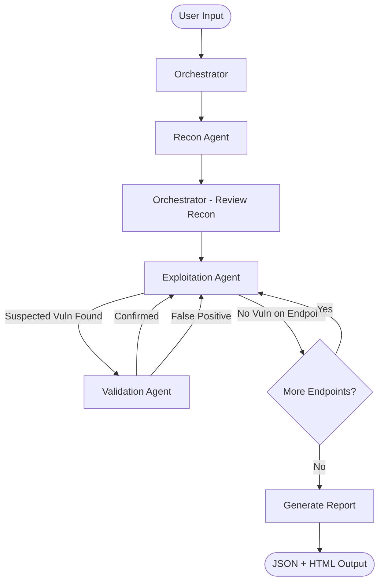

# Project Ronin — V1 Complete Specification

> **Timeline:** 6 days
> **Approach:** CLI-first, black-box API pentesting, 100% local execution

---

## 1. Input Contract

### Mode A: Base URL (Auto-Discovery)
```bash
ronin scan --target https://api.example.com
```
- Ronin's Recon Agent discovers endpoints via crawling, common path fuzzing, and sitemap/robots.txt parsing.

### Mode B: API Document
```bash
# Postman collection
ronin scan --target https://api.example.com --collection ./collection.json

# Plain text file (one endpoint per line)
ronin scan --target https://api.example.com --endpoints ./endpoints.txt
```

**Plain text format:**
```
GET /api/users
POST /api/users
GET /api/users/{id}
PUT /api/users/{id}
DELETE /api/users/{id}
GET /api/products
```

### Scope Filtering
```bash
# Only test specific paths
ronin scan --target https://api.example.com --include "/api/users/*" --include "/api/orders/*"

# Exclude specific paths
ronin scan --target https://api.example.com --exclude "/api/health" --exclude "/api/docs/*"
```

### Authentication (V1 vs V2)

| Version | Behavior |
|---------|----------|
| **V1** | No user-provided auth. Ronin tests public endpoints and **actively tries to crack/bypass authorization** (brute-force tokens, test for missing auth, JWT manipulation, etc.) |
| **V2** | User provides API key / JWT / session cookie. Ronin tests authenticated endpoints + privilege escalation. |

---

## 2. Output Contract

### 2.1 JSON Report (`ronin_report.json`)
```json
{
  "scan_id": "ronin-20260819-223400",
  "target": "https://api.example.com",
  "scan_started": "2026-08-19T22:34:00Z",
  "scan_completed": "2026-08-19T22:41:30Z",
  "total_endpoints_tested": 24,
  "summary": {
    "critical": 1,
    "high": 2,
    "medium": 3,
    "low": 1,
    "info": 4
  },
  "findings": [
    {
      "id": "RONIN-001",
      "title": "BOLA on GET /api/users/{id}",
      "severity": "CRITICAL",
      "cvss_score": 9.1,
      "category": "API1:2023 - Broken Object Level Authorization",
      "description": "Changing the user ID parameter returns other users' data without any authorization check.",
      "proof_of_concept": {
        "request": {
          "method": "GET",
          "url": "https://api.example.com/api/users/42",
          "headers": {}
        },
        "response": {
          "status_code": 200,
          "body_snippet": "{\"id\": 42, \"email\": \"other@user.com\", \"name\": \"Other User\"}"
        }
      },
      "steps_to_reproduce": [
        "Send GET /api/users/1 — observe response with user 1 data",
        "Send GET /api/users/42 — observe response with user 42 data (no auth required)",
        "Different user data is returned without any authentication"
      ],
      "remediation": "Implement object-level authorization checks. Verify the authenticated user has permission to access the requested resource before returning data.",
      "references": [
        "https://owasp.org/API-Security/editions/2023/en/0xa1-broken-object-level-authorization/"
      ]
    }
  ]
}
```

### 2.2 HTML Report (`ronin_report.html`)
- Self-contained single HTML file (inline CSS/JS, no external dependencies)
- Dashboard summary: severity breakdown chart, endpoints tested, scan duration
- Expandable finding cards with: severity badge, PoC request/response, reproduction steps, remediation
- Filterable by severity
- Printable / shareable

### 2.3 CLI Terminal Output (during scan)
```
🔍 Ronin v1.0 — API Security Scanner
━━━━━━━━━━━━━━━━━━━━━━━━━━━━━━━━━━━━

Target:     https://api.example.com
Mode:       Auto-Discovery
Endpoints:  24 discovered

[■■■■■■■■■■■■■■■■■■■■] 100% — Scan Complete

┌─────────────────────────────────────┐
│  RESULTS SUMMARY                    │
├─────────┬───────────────────────────┤
│ CRITICAL│ 1                         │
│ HIGH    │ 2                         │
│ MEDIUM  │ 3                         │
│ LOW     │ 1                         │
│ INFO    │ 4                         │
└─────────┴───────────────────────────┘

Reports saved:
  → ./ronin_runs/ronin-20260819-223400/report.json
  → ./ronin_runs/ronin-20260819-223400/report.html
```

---

## 3. V1 Vulnerability Scope

### Must-Have (Core)

| ID | Category | What Ronin Tests |
|----|----------|-----------------|
| **API1** | **BOLA / IDOR** | Swap object IDs in URL paths and parameters. If different objects are returned without auth → finding. |
| **API2** | **Broken Authentication** | Test for missing auth on endpoints, JWT signature bypass (alg:none), weak token patterns, credential stuffing with common defaults. |
| **API8** | **Security Misconfiguration** | Missing security headers (CORS, CSP, X-Frame-Options), verbose error messages leaking stack traces, exposed debug/docs endpoints (`/swagger`, `/graphql`, `/debug`), HTTP methods allowed that shouldn't be (OPTIONS check). |

### Should-Have (If Time Allows)

| ID | Category | What Ronin Tests |
|----|----------|-----------------|
| **API3** | **Excessive Data Exposure** | Response contains fields that shouldn't be public (password hashes, internal IDs, PII). LLM analyzes response bodies for sensitive patterns. |
| **API5** | **Broken Function Level Auth** | Access admin-level endpoints (`/admin/*`, `/internal/*`) without auth. Test if `DELETE`/`PUT` methods work on read-only resources. |
| **Injection** | **SQLi / XSS** | Fuzz parameters with classic payloads (`' OR 1=1--`, `<script>alert(1)</script>`). Analyze response for error messages or reflected input. |

---

## 4. Agent Architecture — Detailed Design

### 4.1 Global State Schema (Pydantic Model)

```python
class ScanState(BaseModel):
    # Input
    scan_id: str
    target_url: str
    provided_endpoints: list[Endpoint] | None   # From Postman/text file
    include_patterns: list[str]
    exclude_patterns: list[str]
    
    # Recon results
    discovered_endpoints: list[Endpoint]         # Populated by Recon Agent
    
    # Exploitation results
    attack_surface: list[SuspectedVuln]          # Flagged by Exploit Agent
    
    # Validation results
    validated_findings: list[Finding]             # Confirmed by Validation Agent
    
    # Control
    current_phase: Literal["recon", "exploit", "validate", "report"]
    current_endpoint_index: int
    errors: list[str]

class Endpoint(BaseModel):
    method: str                    # GET, POST, PUT, DELETE, PATCH
    path: str                      # /api/users/{id}
    parameters: list[Parameter]    # Query params, path params, body fields
    content_type: str | None       # application/json, etc.
    auth_required: bool | None     # Discovered during recon
    sample_response: dict | None   # Captured during recon

class Parameter(BaseModel):
    name: str
    location: Literal["path", "query", "header", "body"]
    param_type: str                # string, integer, etc.
    required: bool
    sample_value: str | None
```

### 4.2 Agent Definitions

#### Agent 1: Orchestrator
```
Role:        Manager / Router
LLM Calls:   Minimal — mostly deterministic logic
Responsibilities:
  1. Parse CLI input (URL, collection, scope filters)
  2. Initialize the ScanState
  3. Route to Recon Agent → wait for completion
  4. Loop Exploitation Agent over each discovered endpoint
  5. Route suspected vulns to Validation Agent
  6. Compile final report (JSON + HTML)
  7. Handle errors and retries (max 2 retries per agent failure)
```

#### Agent 2: Recon Agent (Scout)
```
Role:        Endpoint discovery and API mapping
LLM Calls:   Medium — used to interpret responses and infer API structure
Tools:
```

| Tool | Input | Output | Description |
|------|-------|--------|-------------|
| `fetch_url` | `url: str, method: str, headers: dict` | `status_code: int, headers: dict, body: str` | Send HTTP request and capture full response |
| `parse_postman_collection` | `file_path: str` | `list[Endpoint]` | Parse Postman JSON into structured endpoints |
| `parse_text_endpoints` | `file_path: str` | `list[Endpoint]` | Parse plain text endpoint list |
| `check_common_paths` | `base_url: str` | `list[Endpoint]` | Probe a wordlist of common API paths (`/api/v1/users`, `/swagger.json`, `/health`, etc.) |
| `parse_openapi_from_response` | `response_body: str` | `list[Endpoint]` | If `/swagger.json` or `/openapi.json` is found, parse it |

```
Output:      Updates discovered_endpoints in ScanState
```

#### Agent 3: Exploitation Agent (Attacker)
```
Role:        Vulnerability discovery per endpoint
LLM Calls:   Heavy — generates attack strategies and interprets responses
Tools:
```

| Tool | Input | Output | Description |
|------|-------|--------|-------------|
| `send_request` | `method, url, headers, body, params` | `status_code, headers, body, response_time` | Send crafted HTTP request to target |
| `generate_bola_tests` | `endpoint: Endpoint` | `list[Request]` | Generate IDOR test cases (swap IDs, sequential enumeration) |
| `generate_auth_bypass_tests` | `endpoint: Endpoint` | `list[Request]` | Generate auth bypass attempts (remove auth header, JWT alg:none, expired tokens) |
| `generate_injection_payloads` | `parameter: Parameter` | `list[str]` | Generate SQLi/XSS payloads appropriate for the parameter type |
| `analyze_response` | `request, response, test_type` | `SuspectedVuln | None` | LLM analyzes if the response indicates a vulnerability |
| `check_security_headers` | `response_headers: dict` | `list[SuspectedVuln]` | Check for missing/misconfigured security headers |

```
Output:      Updates attack_surface in ScanState
```

#### Agent 4: Validation Agent (Verifier)
```
Role:        Confirm or reject suspected vulnerabilities, eliminate false positives
LLM Calls:   Medium — generates PoC scripts and interprets results
Tools:
```

| Tool | Input | Output | Description |
|------|-------|--------|-------------|
| `execute_sandbox_script` | `python_code: str` | `stdout: str, stderr: str, exit_code: int` | Run generated exploit script in isolated Docker container |
| `generate_poc_script` | `suspected_vuln: SuspectedVuln` | `str (Python code)` | LLM generates a standalone Python script that reproduces the exploit |
| `compare_responses` | `response_a, response_b` | `bool, explanation` | Compare two responses to confirm behavioral difference (e.g., BOLA confirmation) |

```
Output:      Updates validated_findings in ScanState
```

### 4.3 LangGraph Flow



---

## 5. Technical Stack

| Component | Technology | Purpose |
|-----------|-----------|---------|
| CLI Framework | Python + `click` or `typer` | Command-line interface |
| Agent Framework | LangGraph | Multi-agent orchestration |
| LLM | Ollama + Qwen 2.5 Coder 7B | Local AI inference |
| HTTP Client | `httpx` (async) | API requests to target |
| Database | MongoDB (Docker) | Scan history, state persistence |
| Sandbox | Alpine Linux (Docker) | Isolated PoC script execution |
| Report Generator | Jinja2 templates | HTML report rendering |
| Containerization | Docker Compose | Infrastructure management |

---

## 6. Build Timeline (6 Days)

| Day | Focus | Deliverable |
|-----|-------|-------------|
| **Day 1** | LLM Integration + Project Skeleton | Ollama running in Docker, Python can send prompts and get responses, CLI scaffolding with `typer`, basic project structure |
| **Day 2** | Recon Agent | Postman/text parser, common path scanner, endpoint discovery working. Given a URL, Ronin outputs a list of discovered endpoints. |
| **Day 3** | Exploitation Agent | BOLA/IDOR tests, auth bypass tests, security header checks. Given an endpoint list, Ronin generates suspected vulnerabilities. |
| **Day 4** | Validation Agent + Sandbox | Docker sandbox executing PoC scripts, false-positive reduction working. Suspected vulns are confirmed or rejected. |
| **Day 5** | Orchestrator + LangGraph Flow | Full pipeline connected: input → recon → exploit → validate → output. State management working end-to-end. |
| **Day 6** | Reports + CLI Polish + Testing | JSON + HTML report generation, CLI progress output, end-to-end testing against a deliberately vulnerable API (e.g., OWASP crAPI or vAPI). |

---

## 7. Project Structure

```
project-ronin/
├── cli/                        # CLI entry point
│   └── main.py                 # typer app, commands (scan, report)
├── agents/                     # LangGraph agent definitions
│   ├── orchestrator.py
│   ├── recon.py
│   ├── exploit.py
│   └── validate.py
├── tools/                      # Agent tool implementations
│   ├── http_client.py          # send_request, fetch_url
│   ├── parsers.py              # postman, text, openapi parsers
│   ├── payloads.py             # BOLA, auth bypass, injection generators
│   ├── analyzers.py            # response analysis, header checks
│   └── sandbox.py              # Docker sandbox execution
├── models/                     # Pydantic models
│   ├── state.py                # ScanState, Endpoint, Finding, etc.
│   └── report.py               # Report data models
├── reports/                    # Report generation
│   ├── json_report.py
│   ├── html_report.py
│   └── templates/
│       └── report.html.j2      # Jinja2 HTML template
├── core/                       # Shared utilities
│   ├── config.py               # Settings, env vars
│   ├── llm.py                  # Ollama client wrapper
│   └── db.py                   # MongoDB connection
├── wordlists/                  # Static resources
│   ├── common_paths.txt
│   ├── sqli_payloads.txt
│   └── xss_payloads.txt
├── docker-compose.yml          # Ollama + MongoDB + Sandbox
├── Dockerfile.sandbox          # Isolated execution environment
├── pyproject.toml              # Python dependencies
└── README.md
```

---

> [!IMPORTANT]
> **V2 Additions (Post-6-Day):**
> - User-provided authentication (API keys, JWT, OAuth)
> - Authenticated endpoint testing + privilege escalation
> - Web dashboard (React/Next.js)
> - Scan history and comparison
> - CI/CD integration
> - Model fine-tuning on vulnerability datasets
